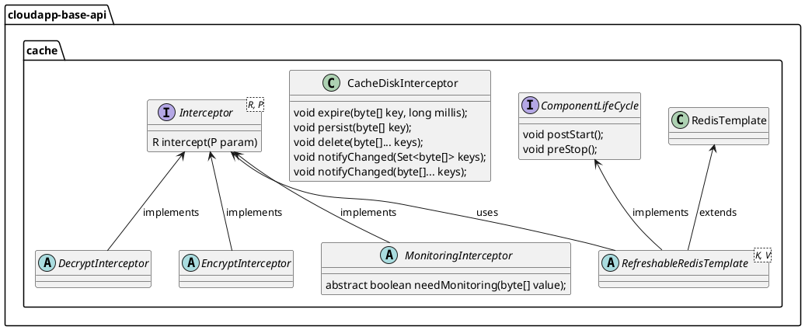

# 分布式缓存设计与使用


# 设计说明

分布式缓存基于 redis 进行设计，在 Framework 设计中，一方面是支持缓存配置动态刷新加载；另一方面是缓存管理能力针对一些特定场景进行增强，如加密、解密可以支持国密算法、缓存磁盘、缓存监控如发现大 key（Big keys）。

分布式缓存抽象设计如下：



1.  定义缓存拦截器接口 _**Interceptor**_ ，主要方法有：
    
    1.  _**intercept(P param)**_ 缓存键值对处理方法；
        
2.  定义缓存磁盘拦截器接口 _**CacheDiskInterceptor**_ ，主要方法由：
    
    1.  _**expire(byte\[\] key, long millis)**_ 设置过期时间；
        
    2.  _**persist(byte\[\] key)**_ 删除指定 key 的过期时间；
        
    3.  _**delete(byte\[\]... keys)**_ 删除 key；
        
    4.  _**notifyChanged(Set<byte\[\]> keys)**_ 值变更时通知；
        
    5.  _**notifyChanged(byte\[\]... keys)**_ 值变更时通知；     
        
3.  定义加密拦截器抽象类 _**DecryptInterceptor**_ ，实现接口 _**Interceptor**_ ；
    
4.  定义解密拦截器抽象类 _**EncryptInterceptor**_ ，实现接口 _**Interceptor**_ ；
    
5.  定义缓存监控拦截器抽象类 _**MonitoringInterceptor**_ ，实现接口 _**Interceptor**_ ，只要方法有：
    
    1.  _**needMonitoring(byte\[\] value)**_ 是否开启监控；
        
6.  定义可刷新 Redis 操作模板抽象类 _**RefreshableRedisTemplate**_ ，实现接口 _**ComponentLifeCycle**_ ，继承类 _**RedisTemplate**_ ；
    

# 使用说明

## 配置说明

分布式缓存实现的配置如下：

1.  定义分布式缓存实现的配置参数类 _**CloudAppRedisProperties**_ ，使用注解 **@ConfigurationProperties(CloudAppRedisProperties.PREFIX)** ，其中 **CloudAppRedisProperties.PREFIX = "io.cloudapp.redis"** ，继承类 _**RefreshableProperties**_ ，配置参数类字段如下：
    

|  **字段名**  |  **数据类型**  |  **默认值**  |  **备注**  |
| --- | --- | --- | --- |
|  enabled  |  boolean  |  \-  |  启用分布式缓存  |
|  hashMonitoring  |  boolean  |  false  |  是否监控哈希类型  |
|  valueMonitoring  |  boolean  |  false  |  是否监控 value  |
|  keyEncrypt  |  boolean  |  true  |  是否加密 key  |
|  usedHash  |  boolean  |  false  |  是否加密和解密哈希类型的 key 和 value  |
|  base  |  **org.springframework.boot.autoconfigure.data.redis.RedisProperties**  | \-  | \-  |
|  **org.springframework.boot.autoconfigure.data.redis.RedisProperties** 类型的 base 字段，其主要字段如下：  | \- | \- | \- |
|  host  |  String  |  \-  |  redis 访问地址  |
|  username  |  String  |  \-  |  redis 访问账号  |
|  password  |  String  |  \-  |  redis 访问密码  |
|  port  |  int  |  \-  |  redis 访问端口  |


## 场景一：缓存磁盘

### POM 配置

```xml
<dependencyManagement>
    <dependencies>
        <dependency>
            <groupId>io.cloudapp</groupId>
            <artifactId>cloudapp-framework-dependencies</artifactId>
            <version>${cloudapp.version}</version>
            <type>pom</type>
            <scope>import</scope>
        </dependency>
    </dependencies>
</dependencyManagement>
<dependencies>
    <dependency>
        <groupId>org.springframework.boot</groupId>
        <artifactId>spring-boot-starter</artifactId>
    </dependency>
    <dependency>
        <groupId>io.cloudapp</groupId>
        <artifactId>spring-boot-starter-cloudapp</artifactId>
    </dependency>
    <dependency>
        <groupId>io.cloudapp</groupId>
        <artifactId>cloudapp-spring-redis</artifactId>
    </dependency>  
</dependencies>
```

### 应用配置

在环境变量中配置 redis 服务访问地址为例

```yaml
spring:
  application:
    name: redis-demo

io:
  cloudapp:
    redis:
      enabled: true
      base:
        host: ${REDIS_HOST}
        port: 6379
```

### 使用验证

```java
@Service
  public class RedisDemoService implements InitializingBean {

    @Autowired
    @Qualifier("refreshableRedisTemplate")
    private RefreshableRedisTemplateImpl redisTemplate;


    @Override
    public void afterPropertiesSet() {
        redisTemplate.opsForValue().set("testValue", "test");
        System.out.println(redisTemplate.opsForValue().get("testValue"));

        redisTemplate.opsForList().rightPushAll("testList", "test", "test2", "test3");
        System.out.println(redisTemplate.opsForList().range("testList", 0, -1));

        redisTemplate.opsForGeo().add("testGeo", new Point(1.1, 2.2), "test");
        System.out.println(redisTemplate.opsForGeo().radius("testGeo", "test", 10));

        redisTemplate.opsForHash().put("testHash", "test", "test2");
        System.out.println(redisTemplate.opsForHash().get("testHash", "test"));

        redisTemplate.opsForSet().add("testSet", "test", "test2");
        System.out.println(redisTemplate.opsForSet().members("testSet"));

        redisTemplate.opsForHyperLogLog().add("testLog", Collections.singletonMap("test", "test2"));
        System.out.println(redisTemplate.opsForHyperLogLog().size("testLog"));

        RecordId id = redisTemplate.opsForStream().add("testStream", Collections.singletonMap("test", "test2"));

        redisTemplate.opsForValue().getAndDelete("testValue");
        redisTemplate.opsForList().leftPop("testList", 3);
        redisTemplate.opsForGeo().remove("testGeo", "test");
        redisTemplate.opsForHash().delete("testHash", "test");
        redisTemplate.opsForSet().remove("testSet", "test", "test2");
        redisTemplate.opsForHyperLogLog().delete("testLog");
        redisTemplate.opsForStream().delete("testStream", id);

    }
}
```
