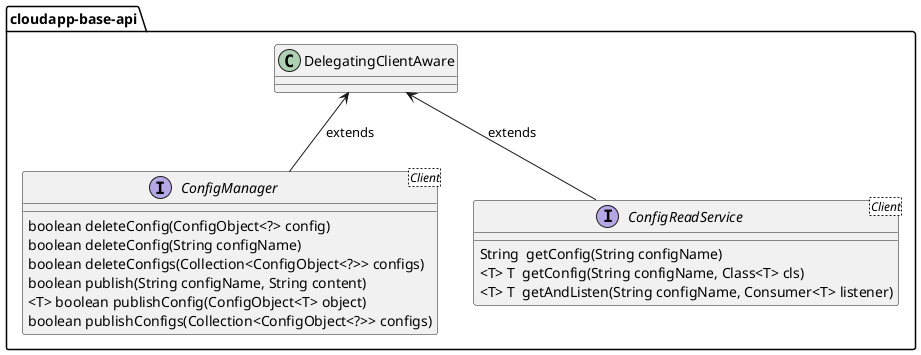

# 分布式配置设计与使用

# 设计说明

分布式配置是基于 Nacos 进行设计，抽象层将主要接口分为两类，一类是以Service为后缀的接口，这类接口更多用于业务链路，它提供给开发者在业务处理中使用。另一类是以Manager为后缀的接口，这类接口更多用于管控链路，用于管理分布式配置服务而非业务处理。在通用场景中，Framework 定义了配置管理接口与配置服务接口用于管理配置和读取监听配置等。在复杂用例场景中，Framework 提供了获取分布式配置底层委托实例的方法，通过委托实例调用分布式配置原生能力。

分布式配置抽象设计如下：



1.  定义配置管理接口 _**ConfigManager**_ ，继承接口 _**DelegatingClientAware**_ ，主要方法有：
    
    1.  _**getDelegatingClient()**_ 获取分布式配置底层委托实例；
        
    2.  _**deleteConfig(String configName)**_ 通过名称删除配置；
        
    3.  _**deleteConfig(ConfigObject<?> config)**_ 删除配置；
        
    4.  _**deleteConfigs(Collection<ConfigObject<?>> configs)**_ 删除一组配置；
        
    5.  _**publish(String configName, String content)**_ 发布配置；
        
    6.  _**publishConfig(ConfigObject<T> object)**_ 发布配置；
        
    7.  _**publishConfigs(Collection<ConfigObject<?>> configs)**_ 发布一组配置
        
2.  定义获取配置服务接口 _**ConfigReadService**_ ，继承接口_**DelegatingClientAware**_ ，主要方法有：
    
    1.  _**getDelegatingClient()**_ 获取分布式配置底层委托实例；
        
    2.  _**getConfig(String configName)**_ 通过名称获取配置； 
        
    3.  _**getConfig(String configName, Class<T> cls)**_ 据配置名称和目标类型获取配置；
        
    4.  _**getAndListen(String configName, Consumer<T> listener)**_ 获取配置值并监听配置更新；
        

# 使用说明

## 配置说明
分布式配置实现的配置如下：


1.  定义获取 nacos 配置服务实现的配置参数类 _**NacosConfigReadServiceProperties**_ ，使用注解 _**@ConfigurationProperties(prefix = "io.cloudapp.config.aliyun.read")**_ ，配置参数类字段如下：
    

|  **字段名**  |  **数据类型**  |  **默认值**  |  **备注**  |
| --- | --- | --- | --- |
|  enabled  |  boolean  |  \-  |  是否启用  |
|  group  |  String  |  DEFAULT\_GROUP  |  配置组  |
|  timeout  |  int  |  3000  |  超时时间，单位毫秒  |

其它配置属性参见 _**com.alibaba.cloud.nacos.NacosConfigProperties**_  类的字段。

2.   定义阿里云配置管理器实现的配置参数类 _**AliyunConfigManagerProperties**_ ，使用注解 _**@ConfigurationProperties(prefix = "io.cloudapp.config.aliyun.write")**_ ，配置参数类字段如下：
    

|  **字段名**  |  **数据类型**  |  **默认值**  |  **备注**  |
| --- | --- | --- | --- |
|  enabled  |  boolean  |  \-  |  是否启用阿里云配置管理器  |
|  group  |  String  |  DEFAULT\_GROUP  |  配置组  |
|  timeout  |  int  |  3000  |  超时时间，单位毫秒  |
|  domain  |  String  |  \-  |  配置中心访问地址，示例值：acm.cn-hangzhou.aliyuncs.com  |
|  regionId  |  String  |  \-  |  区域，示例值：cn-hangzhou  |
|  protocol  |  String  |  http  |  访问协议，可选值：http、https  |
|  accessKey  |  String  |  \-  |  配置中心访问凭证 AK  |
|  secretKey  |  String  |  \-  |  配置中心访问凭证 SK  |
|  namespaceId  |  String  |  \-  |  配置中心命名空间  |


## 场景一：获取并监听配置

### POM 配置

```xml
<dependencyManagement>
    <dependencies>
        <dependency>
            <groupId>io.cloudapp</groupId>
            <artifactId>cloudapp-framework-dependencies</artifactId>
            <version>1.0.0</version>
            <type>pom</type>
            <scope>import</scope>
        </dependency>
    </dependencies>
</dependencyManagement>
<dependencies>
    <dependency>
        <groupId>org.springframework.boot</groupId>
        <artifactId>spring-boot-starter</artifactId>
    </dependency>
    <dependency>
        <groupId>io.cloudapp</groupId>
        <artifactId>spring-boot-starter-cloudapp</artifactId>
    </dependency>
    <dependency>
        <groupId>io.cloudapp</groupId>
        <artifactId>cloudapp-spring-config-aliyun</artifactId>
    </dependency>
    <dependency>
        <groupId>org.springframework.boot</groupId>
        <artifactId>spring-boot-starter-web</artifactId>
    </dependency>
</dependencies>
```

### 应用配置

```properties files
spring:
  application:
    name: config-aliyun-demo
  cloud:
    nacos:
      config:
        server-addr: 127.0.0.1:8848
        import-check:
          enabled: false
io:
  cloudapp:
    config:
      aliyun:
        read:
          enabled: true
          timeout: 5000
          group: cloudapp
        
```

### 使用验证

```java
@RestController 
public class DemoReadController {

    public static final Logger logger = LoggerFactory.getLogger(DemoReadController.class);

    @Autowired 
    private ConfigReadService configReadService;

    @ResponseBody 
    @RequestMapping("/config") 
    public String getConfig(@RequestParam("name") String name) {
        String result = configReadService.getConfig(name);
        logger.info("getConfig name={},result={}", name, result);
        return result;
    }

    @ResponseBody 
    @RequestMapping("/listen") 
    public String listen(@RequestParam("name") String name) {
        String result = (String)configReadService.getAndListen(name, new Consumer<String>() {
            @Override 
            public void accept(String o) {
                logger.info("receive content {} for configName={}", o, name);
            }
        });
        logger.info("listenConfig name={},result={}", name, result);
        return result;
    }

}
```