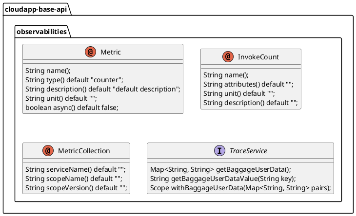
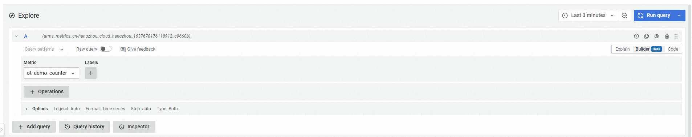

# 可观测设计与使用


# 设计说明

可观测是基于 [OpenTelemetry](https://opentelemetry.io/)（以下简称 OTel） 进行设计，提供对指标（Metric）、日志和追踪的可观测能力。对于指标，抽象定义了指标相关的注解：指标收集器 **@MetricCollection** 、指标 **@Metric** 、方法计数器  **@InvokeCount** ，提供了字段粒度和方法粒度的指标统计注解。对于日志，通过自动修改日志配置实现 log4j2 框架日志与 traceid、spanid 等追踪数据关联。对于追踪，通过追踪服务提供流量标识能力。

可观测抽象设计如下：



1.  定义指标收集器注解 _**@MetricCollection**_ ，将类标注为指标收集器；
    
2.  定义指标注解 _**@Metric**_ ，用于在指标收集器类中标注字段。在指标收集器类中被标记为指标的、且有 set 方法的字段将作为指标数据进行采集；
    
3.  定义方法计数器注解 _**@InvokeCount**_ ，用于在指标收集器类中标注方法。在指标收集器类中被标记为方法计数器的方法，将作为指标数据进行采集。
    
4.  定义追踪服务接口 _**TraceService**_ ，主要方法有：
    
    1.  _**getBaggageUserData()**_ 获取当前在链路传递中的用户请求数据，例如：请求上下文中的用户数据；
        
    2.  _**getBaggageUserDataValue(String key)**_ 获取当前在链路传递中用户某个请求数据，例如：请求上下文中的用户数据值；
        
    3.  _**withBaggageUserData(Map<String, String> pairs)**_ 构建 opentelemetry 范围对象以指定用户数据将被带到的位置；
        

# 使用说明

## 配置说明
可观测实现的配置如下：

1.  定义可观测自动配置参数类 _**OpenTelemetryProperties**_ ，使用注解 _**@ConfigurationProperties(OpenTelemetryProperties.PREFIX)**_ ， _**OpenTelemetryProperties.PREFIX="io.cloudapp.observabilities.ot"**_ ，其中字段如下：
    

|  **字段名**  |  **数据类型**  |  **默认值**  |  **备注**  |
| --- | --- | --- | --- |
|  enabled  |  boolean  |  \-  |  是否启用  |
|  metricEndpoint  |  String  |  \-  |  指标 Metric 导出端点，如：http://tracing-analysis-dc-bj.aliyuncs.comxxxxxx/api/otlp/metrics  |
|  timeout  |  Integer  |  10  |  超时时间，单位秒  |
|  interval  |  Integer  |  30  |  间隔时间，单位秒  |
|  defaultServiceName  |  String  |  default  |  默认服务名称  |
|  enabledHelperServer  |  Boolean  |  false  |  是否启用内部指标导出的helper服务接口  |
|  helperServerPort  |  Integer  |  56199  |  启用的helper服务端口号  |
|  helperServerBindAddress  |  String  |  127.0.0.1  |  启用的helper服务绑定的地址  |
|  prometheusExporter  |  Boolean  |  false  |  是否开启使用prometheus导出接口  |
|  prometheusPort  |  Integer  |  9464  |  配置prometheus导出端口  |

2.  定义可观测的日志自动配置参数类 _**OpenTelemetryLoggingProperties**_ ，使用注解 _**@ConfigurationProperties(OpenTelemetryLoggingProperties.PREFIX)**_ ， _**OpenTelemetryLoggingProperties.PREFIX="io.cloudapp.observabilities.ot.logging"**_ ，其中字段如下：
    

|  **字段名**  |  **数据类型**  |  **默认值**  |  **备注**  |
| --- | --- | --- | --- |
|  enableTraceId  |  boolean  |  \-  |  是否启用日志与 traceid 关联  |


## 场景一：统计方法调用次数

### POM 配置

在依赖中引入opentelemetry 的实现

```xml
……
<dependencies>
    <dependency>
        <groupId>io.cloudapp</groupId>
        <artifactId>spring-boot-starter-cloudapp</artifactId>
    </dependency>
    <dependency>
        <groupId>org.springframework.boot</groupId>
        <artifactId>spring-boot-starter-web</artifactId>
    </dependency>
    <dependency>
        <groupId>io.cloudapp</groupId>
        <artifactId>cloudapp-observabilities-opentelemetry</artifactId>
    </dependency>
    <dependency>
        <groupId>org.projectlombok</groupId>
        <artifactId>lombok</artifactId>
        <version>1.16.16</version>
        <scope>provided</scope>
    </dependency>
</dependencies>
……
```

### 应用配置

在环境变量中配置 metric 导出终端的 url，如下：

```yaml
spring:
  application:
    name: cloudapp-observabilites-opentelemetry-demo
  cloud:
    nacos:
      discovery:
        server-addr: 127.0.0.1:8848
      config:
        import-check:
          enabled: false

server:
  port: 20001


io:
  cloudapp:
    observabilities:
      ot:
        # enable metric enhance feature
        enabled: true
        # enable metric helper server
        enabled-helper-server: true
        # set helper server binding address
        helper-server-bind-address: 127.0.0.1
        # set helper server binding port
        helper-server-port: 20002
#        prometheus-exporter: true
        metric-endpoint: {endpoint}
        logging:
          enable-traceid: true
```

### 使用验证

如下示例中使用 **@MetricCollection** 注解将当前类标记为指标收集器；然后使用 **@InvokeCount** 注解将当前方法标记为采集对象，注解中“args\_1”表示采集时的参数名称、“args[1]”表示传入方法的第2个参数的值。调用 /invokeCount/{username} 时将采集方法的调用次数

```java
@RestController
@MetricCollection(serviceName = "ot-demo")
public class DemoController {
    
    private static final Logger logger = LoggerFactory.getLogger(
            DemoController.class);
    @GetMapping("/invokeCount/{username}")
    @InvokeCount(name = "ot_demo_counter", attributes = "args_1=args[1]")
    public void invoke(HttpServletRequest request,
                       @PathVariable String username) {
        logger.info("user {} invoke.", username);
    }
    
}
```

结果如下：



