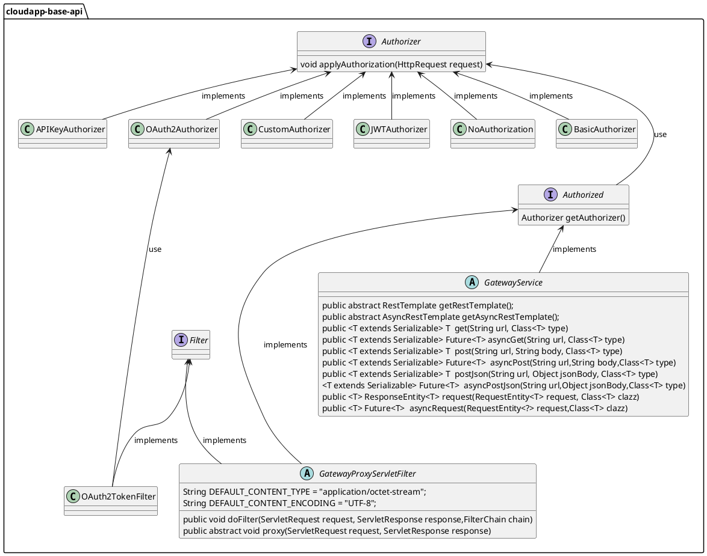
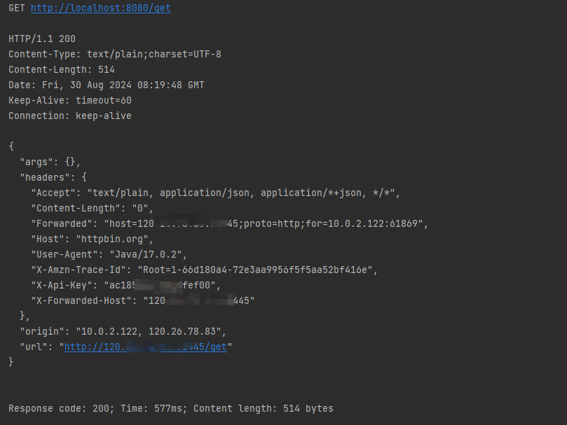
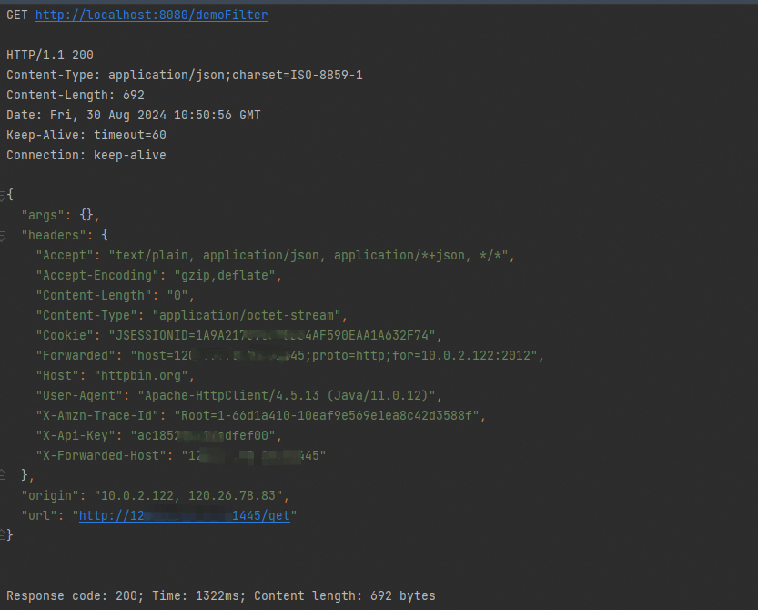

# 服务网关设计与使用

# 设计说明

服务网关本质是一个处理 Http 请求的服务，作为统一出入口处理各种类型的 Http 请求。在 Framework 中，定义了鉴权处理接口，在 Basic、API Key、JWT、OAuth2 等常见鉴权类型场景中，Framework 定义了各种鉴权类型对应的鉴权处理类；在有特殊逻辑或希望自定义鉴权处理逻辑场景下，也提供了对应的自定义鉴权处理类。

服务网关有两个主要工作场景：通用服务网关和代理网关，Framework 定义了对应的抽象类。通用服务网关可以作为一个标准的服务，可以处理请求并生成响应。代理网关作为一个代理，将接收的请求转发给其他服务，并将服务响应返回。


服务网关抽象设计如下：



1.  定义鉴权处理接口 _**Authorizer**_ ，主要方法有：
    
    1.  _**applyAuthorization()**_ 添加鉴权信息到请求头中；
        
2.  定义 APIKey 鉴权处理类 _**APIKeyAuthorizer**_ ;
    
3.  定义 BasicAuth 鉴权处理类 _**BasicAuthorizer**_ ；
    
4.  定义 JWTAuth 鉴权处理类 _**JWTAuthorizer**_ ；
    
5.  定义无需鉴权处理类 _**NoAuthorizatiohuon**_ ；
    
6.  定义 OAuth2 鉴权处理类 _**OAuth2Authorizer**_ ；
    
7.  定义自定义鉴权处理类 _**CustomAuthorizer**_ ；
    
8.  定义鉴权接口 _**Authorized**_ ；
    
9.  定义网关直接处理请求抽象类 _**GatewayService**_ ，主要方法有：
    
    1.  _**getRestTemplate()**_ 获取 RestTemplate 的委托类；
        
    2.  _**getAsyncRestTemplate()**_ 获取异步 RestTemplate 的委托类；
        
    3.  _**get(String url, Class<T> type)**_ 发起 get 请求；
        
    4.  _**asyncGet(String url, Class<T> type)**_ 发起异步 get 请求；
        
    5.  _**post(String url, String body, Class<T> type)**_ 发起 post 请求，内容类型为：application/x-www-form-urlencoded；
        
    6.  _**asyncPost(String url,String body,Class<T> type)**_ 发起异步 post 请求；
        
    7.  _**postJson(String url, Object jsonBody, Class<T> type)**_ 发起 post 请求，内容类型为：application/json；
        
    8.  _**asyncPostJson(String url,Object jsonBody,Class<T> type)**_ 发起异步 post 请求，内容类型为：application/json；
        
    9.  _**request(RequestEntity<T> request, Class<T> clazz**_) 发起复杂请求；
        
    10.  _**asyncRequest(RequestEntity<?> request,Class<T> clazz)**_ 发起异步复杂请求；
        
10.  定义网关代理请求抽象类 _**GatewayProxyServletFilter**_ ，主要方法有：
    1.  _**doFilter(ServletRequest request, ServletResponse response,FilterChain chain)**_ 处理过滤器；
    2.  _**proxy(ServletRequest request, ServletResponse response)**_ 抽象方法，代理请求；
        

# 使用说明

## 配置说明

服务网关实现的配置如下：


1.  定义 CSB 服务消费者的鉴权实现的配置参数类 _**ApiGatewayProperties**_ ，使用注解 _**@ConfigurationProperties(prefix = "io.cloudapp.apigateway.aliyun")**_ ，配置参数类字段如下：
    

|  **字段名**  |  **数据类型**  |  **默认值**  |  **备注**  |
| --- | --- | --- | --- |
|  apiKey  |  **ApiKeyProperties**  |  \-  |  APIKey 鉴权参数类，CSB 服务 APIKey 鉴权类型的消费者鉴权信息，由 CSB 服务在创建对应鉴权类型的消费者时生成，生成后从 CSB 服务获取；  |
|  jwt  |  **JwtProperties**  |  \-  |   JWT 鉴权参数类，CSB 服务 JWT 鉴权类型的消费者鉴权信息，由 CSB 服务在创建对应鉴权类型的消费者时生成，生成后从 CSB 服务获取；  |
|  oAuth2  |  **BasicProperties**  |  \-  |  Basic 鉴权参数类_**，**_CSB 服务 OAuth2 鉴权类型的消费者鉴权信息，由 CSB 服务在创建对应鉴权类型的消费者时生成，生成后从 CSB 服务获取；  |
|  basic  |  **OAuth2Properties**  |  \-  |  OAuth2 鉴权参数类，CSB 服务 Basic 鉴权类型的消费者鉴权信息，由 CSB 服务在创建对应鉴权类型的消费者时生成，生成后从 CSB 服务获取；  |

定义 APIKey 鉴权参数类 _**ApiKeyProperties**_ ，字段如下：
    

|  **字段名**  |  **数据类型**  |  **默认值**  |  **备注**  |
| --- | --- | --- | --- |
|  apiKey  |  String  |  \-  |  apikey 值  |
|  headerName  |  String  |  \-  |  apikey 值在请求头中的参数名  |

定义 JWT 鉴权参数类 _**JwtProperties**_ ，字段如下：
    

|  **字段名**  |  **数据类型**  |  **默认值**  |  **备注**  |
| --- | --- | --- | --- |
|  keyId  |  String  |  \-  |  Key  |
|  secret  |  String  |  \-  |  密钥  |
|  issuer  |  String  |  \-  |  签发方  |
|  subject  |  String  |  \-  |  主题  |
|  audience  |  String  |  \-  |  接收方  |
|  expiredSecond  |  long  |  \-  |  过期时间，单位秒  |
|  base64EncodeSecret  |  boolean  |  false  |  是否对密钥进行 base64 编码  |
|  algorithm  |  String  |  HS256  |  签名算法  |

定义 Basic 鉴权参数类 _**BasicProperties**_ ，字段如下：
    

|  **字段名**  |  **数据类型**  |  **默认值**  |  **备注**  |
| --- | --- | --- | --- |
|  username  |  String  |  \-  |  用户名  |
|  password  |  String  |  \-  |  密码  |

定义 OAuth2 鉴权参数类 _**OAuth2Properties**_ ，字段如下：
    

|  **字段名**  |  **数据类型**  |  **默认值**  |  **备注**  |
| --- | --- | --- | --- |
|  scopes  |  List<String>  |  \-  |  客户端（即第三方应用）权限范围  |
|  clientId  |  String  |  \-  |  客户端ID  |
|  clientSecret  |  String  |  \-  |  客户端密钥  |
|  redirectUri  |  String  |  \-  |  用户授权操作后的跳转地址  |
|  enablePkce  |  boolean  |  \-  |  是否启用授权码交换证明密钥 (PKCE)   |
|  tokenUri  |  String  |  \-  |  认证服务器用于处理认证请求（获取 token、刷新 token 等）的地址；  |
|  authorizationUri  |  String  |  \-  |  获取授权码的地址  |

2.  定义 CSB 网关服务的配置参数类 _**ApiGatewayManagerProperties**_ ，使用注解 _**@ConfigurationProperties(prefix = "io.cloudapp.apigateway.aliyun.server")**_ ，配置参数类字段如下：
    

|  **字段名**  |  **数据类型**  |  **默认值**  |  **备注**  |
| --- | --- | --- | --- |
|  accessKey  |  String  |  \-  |  CSB 服务的访问凭证 AK，从 CSB 服务获取  |
|  secretKey  |  String  |  \-  |  CSB 服务的访问凭证 SK，从 CSB 服务获取  |
|  gatewayUri  |  String  |  \-  |  CSB 服务的访问地址  |


## 场景一：通用服务网关处理请求

服务网关作为一个通用服务网关，对请求进行处理。

### POM 配置

```xml
<dependencyManagement>
    <dependencies>
        <dependency>
            <groupId>io.cloudapp</groupId>
            <artifactId>cloudapp-framework-dependencies</artifactId>
            <version>1.0.0</version>
            <type>pom</type>
            <scope>import</scope>
        </dependency>
    </dependencies>
</dependencyManagement>

<dependencies>
    <dependency>
        <groupId>org.springframework.boot</groupId>
        <artifactId>spring-boot-starter</artifactId>
    </dependency>

    <dependency>
        <groupId>io.cloudapp</groupId>
        <artifactId>spring-boot-starter-cloudapp</artifactId>
    </dependency>

     <dependency>
         <groupId>org.springframework.boot</groupId>
         <artifactId>spring-boot-starter-web</artifactId>
     </dependency>

    <dependency>
        <groupId>io.cloudapp</groupId>
        <artifactId>cloudapp-spring-apigateway-aliyun</artifactId>
    </dependency>
</dependencies>
```

### 应用配置

通用服务网关应用以 APIKey 鉴权方式处理与 CSB 服务请求为例，在环境变量中设置 apikey，并将请求头参数名X-API-KEY 为例;

```yaml
spring:
  application:
    name: apigateway-aliyun-demo
  main:
    allow-bean-definition-overriding: true

io:
  cloudapp:
    apigateway:
      aliyun:
        apikey:
          apiKey: ${apiKey}
          headerName: X-API-KEY
```

### 使用验证

通用服务网关向 CSB 平台上开放服务发起请求为例， 请求开放服务 path 为/get， 需要在环境变量中开放服务访问地址brokerAddress。

```java
@RestController
public class UniversalServiceGatewayDemoController {

    @Autowired
    @Qualifier("gatewayService")
    GatewayService gatewayService;

    @Value("${brokerAddress}")
    private String brokerUrl;

    private static final Logger logger = LoggerFactory.getLogger(UniversalServiceGatewayDemoController.class);

    @RequestMapping("/get")
    public String get() {
        String response = null;
        try {
            response = gatewayService.get(brokerUrl + "/get", String.class);
        } catch (CloudAppException e) {
            e.printStackTrace();
        }
        logger.info("The simple get request response is: {}", response);
        return response;
    }
}
```



## 场景二：代理网关转发请求

代理网关转发请求，并将配置的 Basic 类型的鉴权信息改为 APIKey 类型的。

### POM 配置

```xml
<dependencyManagement>
    <dependencies>
        <dependency>
            <groupId>io.cloudapp</groupId>
            <artifactId>cloudapp-framework-dependencies</artifactId>
            <version>1.0.0</version>
            <type>pom</type>
            <scope>import</scope>
        </dependency>
    </dependencies>
</dependencyManagement>

<dependencies>
    <dependency>
        <groupId>org.springframework.boot</groupId>
        <artifactId>spring-boot-starter</artifactId>
    </dependency>

    <dependency>
        <groupId>io.cloudapp</groupId>
        <artifactId>spring-boot-starter-cloudapp</artifactId>
    </dependency>

     <dependency>
         <groupId>org.springframework.boot</groupId>
         <artifactId>spring-boot-starter-web</artifactId>
     </dependency>

    <dependency>
        <groupId>io.cloudapp</groupId>
        <artifactId>cloudapp-spring-apigateway-aliyun</artifactId>
    </dependency>
</dependencies>
```

### 应用配置

应用配置 Basic 类型鉴权信息，在环境变量中设置用户名、密码；

```yaml
spring:
  application:
    name: apigateway-aliyun-demo
  main:
    allow-bean-definition-overriding: true

io:
  cloudapp:
    apigateway:
      aliyun:
        basic:
          username: ${username}
          password: ${password}
```

### 使用验证

1.  首先定义一个继承了GatewayProxyServletFilter 的 filter，过滤 path 为 /demoFilter；filter 中将原请求转发到 CSB 中开放服务的 /get 并将请求结果返回，其中会将鉴权处理器设置为 APIKey 类型鉴权处理，在环境变量中设置开放服务访问地址brokerAddress 和 apikey；
    

```java
@WebFilter(filterName = "ProxyGatewayDemoFilter", urlPatterns = "/demoFilter")
public class ProxyGatewayDemoFilter extends GatewayProxyServletFilter {

    @Value("${brokerAddress}")
    private String brokerAddress;

    @Value("${apiKey}")
    private String apiKey;

    @Override
    public void proxy(ServletRequest request, ServletResponse response) throws CloudAppException {
        HttpServletRequest httpRequest = (HttpServletRequest) request;
        URL targetUrl = null;
        try {
            targetUrl = new URL(brokerAddress + "/get");
        } catch (MalformedURLException e) {
            e.printStackTrace();
        }
        RestTemplate restTemplate = new RestTemplate();
        ResponseEntity<String> responseEntity;
        try {
            restTemplate.setInterceptors(Collections.singletonList((request1, body, execution) -> {
                try {
                    getAuthorizer().applyAuthorization(request1);
                } catch (CloudAppException e) {
                    e.printStackTrace();
                }

                return execution.execute(request1, body);
            }));
            responseEntity = restTemplate.exchange(
                    targetUrl.toURI(),
                    HttpMethod.valueOf(httpRequest.getMethod()),
                    createHttpEntity(httpRequest),
                    String.class
            );
        } catch (URISyntaxException e) {
            throw new CloudAppException("Invalid URI", e);
        }
        HttpServletResponse httpResponse = (HttpServletResponse) response;
        httpResponse.setStatus(responseEntity.getStatusCodeValue());
        httpResponse.setContentType(responseEntity.getHeaders().getContentType().toString());
        try (PrintWriter writer = httpResponse.getWriter()) {
            writer.print(responseEntity.getBody());
        } catch (IOException e) {
            throw new CloudAppException("Error writing response", e);
        }
    }

    private HttpEntity<?> createHttpEntity(HttpServletRequest request) {
        HttpHeaders headers = new HttpHeaders();
        Enumeration<String> headerNames = request.getHeaderNames();
        while (headerNames.hasMoreElements()) {
            String headerName = headerNames.nextElement();
            Enumeration<String> headerValues = request.getHeaders(headerName);
            while (headerValues.hasMoreElements()) {
                String headerValue = headerValues.nextElement();
                headers.add(headerName, headerValue);
            }
        }
        byte[] body = readRequestBody(request);
        return new HttpEntity<>(body, headers);
    }

    private byte[] readRequestBody(HttpServletRequest request) {
        try (InputStream input = request.getInputStream();
             ByteArrayOutputStream output = new ByteArrayOutputStream()) {
            byte[] buffer = new byte[1024];
            int len;
            while ((len = input.read(buffer)) > -1) {
                output.write(buffer, 0, len);
            }
            return output.toByteArray();
        } catch (IOException e) {
            try {
                throw new CloudAppException("Error reading request body", e);
            } catch (CloudAppException ex) {
                ex.printStackTrace();
            }
        }
        return null;
    }


    @Override
    public Authorizer getAuthorizer() throws CloudAppException {
        return new APIKeyAuthorizer(apiKey);
    }
}
```

2.  发起请求，会请求 filer 拦截转发
    

```java
@RestController
public class ProxyGatewayDemoController {

    @Autowired
    GatewayService gatewayService;

    private static final Logger logger = LoggerFactory.getLogger(ProxyGatewayDemoController.class);

    @Value("${brokerAddress}")
    private String brokerAddress;
    @RequestMapping("/demoFilter")
    public String demoFilter() {
        String response = null;
        try {
            response = gatewayService.get(brokerAddress + "/get",String.class);
        } catch (CloudAppException e) {
            e.printStackTrace();
        }
        logger.info("The response is: {}", response);
        return response;
    }

}
```

3.  请求结果如下
    



## 场景三：服务网关 basic 鉴权

服务网关鉴权处理，以 basic 鉴权类型为例。

### POM 配置

```xml
<dependencyManagement>
    <dependencies>
        <dependency>
            <groupId>io.cloudapp</groupId>
            <artifactId>cloudapp-framework-dependencies</artifactId>
            <version>1.0.0</version>
            <type>pom</type>
            <scope>import</scope>
        </dependency>
    </dependencies>
</dependencyManagement>

<dependencies>
    <dependency>
        <groupId>org.springframework.boot</groupId>
        <artifactId>spring-boot-starter</artifactId>
    </dependency>

    <dependency>
        <groupId>io.cloudapp</groupId>
        <artifactId>spring-boot-starter-cloudapp</artifactId>
    </dependency>

     <dependency>
         <groupId>org.springframework.boot</groupId>
         <artifactId>spring-boot-starter-web</artifactId>
     </dependency>

    <dependency>
        <groupId>io.cloudapp</groupId>
        <artifactId>cloudapp-spring-apigateway-aliyun</artifactId>
    </dependency>
</dependencies>
```

### 应用配置

通用服务网关应用以 Basic 鉴权方式处理与 CSB 服务请求为例，在环境变量中设置用户名、密码;

```yaml
spring:
  application:
    name: apigateway-aliyun-demo
  main:
    allow-bean-definition-overriding: true

io:
  cloudapp:
    apigateway:
      aliyun:
        basic:
          username: ${username}
          password: ${password}
```

### 使用验证

通用服务网关向 CSB 平台上开放服务发起请求为例， 请求开放服务 path 为/post， 需要在环境变量中开放服务访问地址brokerAddress；

```java
@RestController
public class UniversalServiceGatewayDemoController {

    @Autowired
    @Qualifier("gatewayService")
    GatewayService gatewayService;

    @Value("${brokerAddress}")
    private String brokerUrl;

    private static final Logger logger = LoggerFactory.getLogger(UniversalServiceGatewayDemoController.class);

    @RequestMapping("/post")
    public String post() {
        String response = null;
        try {
            response = gatewayService.post(brokerUrl + "/post", "", String.class);
        } catch (CloudAppException e) {
            e.printStackTrace();
        }
        logger.info("The simple post request response is: {}", response);
        return response;
    }
}
```

