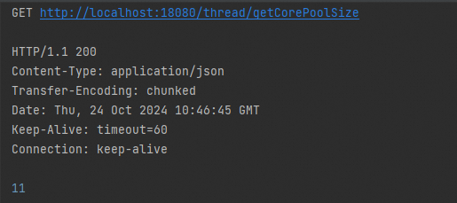
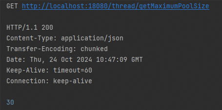

# 线程池设计与使用

# 设计说明

框架提供线程池配置动态刷新能力，为应用提供无需重启即可动态调整线程池配置的能力。例如在线程池监控场景中，可以通过监控线程池性能指标了解应用负载情况，然后基于监控数据对应用进行性能优化、负载均衡等后续操作。


# 使用说明

## 配置说明

线程池动态刷新实现的配置如下：


1.  定义线程池实现的配置参数类 _**ThreadPoolProperties**_ ，继承 _**RefreshableProperties**_ ，使用注解 _**@ConfigurationProperties(prefix = ThreadPoolProperties.BINDING\_PROP\_KEY)**_ ，其中 _**ThreadPoolProperties.BINDING\_PROP\_KEY=“io.cloudapp.base.threadpool”**_ ，配置参数类字段如下：
    

|  **字段名**  |  **数据类型**  |  **默认值**  |  **备注**  |
| --- | --- | --- | --- |
|  enabled  |  boolean  |  \-  |  是否启用  |
|  corePoolSize  |  int  |  2  |  核心线程池数量，它是保持活动状态的最小线程数  |
|  maximumPoolSize  |  int  |  10  |  最大线程池数量  |
|  keepAliveSeconds  |  int  |  5  |  等待工作的空闲线程的超时（以秒为单位）。当存在的线程数超过 corePoolSize时，线程将使用此超时数值；否则将一直等待。  |
|  queueCapacity  |  int  |  100  |  队列大小  |
|  threadNamePrefix  |  String  |  Base  |  线程名称前缀  |
|  awaitTerminationSeconds  |  long  |  1  |  等待终止时长，单位：秒  |
|  allowCoreThreadTimeOut  |  boolean  |  true  |  允许核心线程超时  |


## 场景一：监控线程池指标


### POM配置

添加 CloudApp Starter 、框架 api 和 spring-cloud-nacos 的依赖。

```xml
……
<dependencies>
    
    <dependency>
        <groupId>io.cloudapp</groupId>
        <artifactId>spring-boot-starter-cloudapp</artifactId>
    </dependency>

    <dependency>
        <groupId>io.cloudapp</groupId>
        <artifactId>cloudapp-base-api</artifactId>
    </dependency>

    <dependency>
        <groupId>org.springframework.boot</groupId>
        <artifactId>spring-boot-starter-web</artifactId>
    </dependency>

    <dependency>
        <groupId>com.alibaba.cloud</groupId>
        <artifactId>spring-cloud-starter-alibaba-nacos-config</artifactId>
    </dependency>

</dependencies>
……
```

### 应用配置

在应用中配置 CloudApp 的属性，主要包括两部分的配置，一是线程池配置，二是集成配置中心 nacos 的配置；

```yaml
io:
  cloudapp:
    base:
      threadpool:
        enabled: true
        corePoolSize: 6
        maximumPoolSize: 9
        
spring:
  application:
    name: thread-pool-demo
  config:
    import: nacos:thread-pool-demo.yaml?refresh=true
  cloud:
    nacos:
      config:
        server-addr: 127.0.0.1:8848
        username: nacos
        password: nacos
        group: DEFAULT_GROUP
server:
  port: 18080
```

### 使用验证

以查看线程池的核心线程池数量、最大线程数量为例如下

```java
@RestController
public class ThreadDemoController {
    
    private static final Logger logger = LoggerFactory.getLogger(
            ThreadDemoController.class);
    
    @Autowired
    private ThreadPoolExecutor monitoringThreadPool;
    
    @GetMapping("/thread/getCorePoolSize")
    public int getCorePoolSize() {
        int corePoolSize = monitoringThreadPool.getCorePoolSize();
        logger.info("corePoolSize: {}", corePoolSize);
        return corePoolSize;
    }
    
    @GetMapping("/thread/getMaximumPoolSize")
    public int getMaximumPoolSize() {
        int maximumPoolSize = monitoringThreadPool.getMaximumPoolSize();
        logger.info("maximumPoolSize: {}", maximumPoolSize);
        return maximumPoolSize;
    }
    
    @GetMapping("/thread/getKeepAliveSeconds")
    public int getKeepAliveSeconds() {
        int keepAliveTime = (int) monitoringThreadPool.getKeepAliveTime(
                TimeUnit.SECONDS);
        return keepAliveTime;
    }
    
}

```






## 场景二：集成外部配置中心 nacos 动态扩容线程池数量

与外部配置中心 Nacos 集成，实现线程池动态扩容。

### POM配置

添加 CloudApp Starter 和 框架 api 的依赖。

```xml
……
<dependencies>
    
    <dependency>
        <groupId>io.cloudapp</groupId>
        <artifactId>spring-boot-starter-cloudapp</artifactId>
    </dependency>

    <dependency>
        <groupId>io.cloudapp</groupId>
        <artifactId>cloudapp-base-api</artifactId>
    </dependency>

    <dependency>
        <groupId>org.springframework.boot</groupId>
        <artifactId>spring-boot-starter-web</artifactId>
    </dependency>

    <dependency>
        <groupId>com.alibaba.cloud</groupId>
        <artifactId>spring-cloud-starter-alibaba-nacos-config</artifactId>
    </dependency>

</dependencies>
……
```

### 应用配置

在应用中配置 CloudApp 的属性，主要包括两部分的配置，一是线程池配置，二是集成配置中心 nacos 的配置；

```yaml
io:
  cloudapp:
    base:
      threadpool:
        enabled: true
        corePoolSize: 6
        maximumPoolSize: 9
        
spring:
  application:
    name: thread-pool-demo
  config:
    import: nacos:thread-pool-demo.yaml?refresh=true
  cloud:
    nacos:
      config:
        server-addr: 127.0.0.1:8848
        username: nacos
        password: nacos
        group: DEFAULT_GROUP
server:
  port: 18080
```

### 使用验证

```java
@RestController
public class ThreadDemoController {
    
    private static final Logger logger = LoggerFactory.getLogger(
            ThreadDemoController.class);
    
    @Autowired
    private ThreadPoolExecutor monitoringThreadPool;
    
    @GetMapping("/thread/getMaximumPoolSize")
    public int getMaximumPoolSize() {
        int maximumPoolSize = monitoringThreadPool.getMaximumPoolSize();
        logger.info("maximumPoolSize: {}", maximumPoolSize);
        return maximumPoolSize;
    }
    
}

```

1.  首先查看当前线程池最大数量
    


2.  根据应用负载情况判断需要扩容线程池。在 nacos 中添加应用监听的配置如下：
    


3.  再次查看当前线程池最大数量。可见应用在未重启情况下，完成线程池动态扩容。
    


