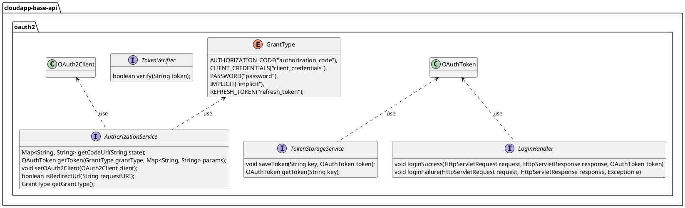

# OAuth2应用设计与使用

# 设计说明

oauth2应用 是基于 [OAuth2.0 规范](https://datatracker.ietf.org/doc/html/rfc6749) 进行设计。框架主要对 OAuth2 中令牌(token)的常用操作进行抽象设计，包括：获取、存储和验证。定义了认证授权服务AuthorizationService 用于处理获取令牌，包括获取访问令牌(access token)和刷新令牌(access token)；定义令牌存储服务TokenStorageService 用于存储已获取的令牌，例如存储在应用内存中或 redis 中间件。同时，定义登录处理器、令牌验证器，用于处理登录操作和验证令牌。

oauth2应用 抽象设计如下：



1.  定义认证授权服务接口 _**AuthorizationService**_ ，主要方法有：
    
    1.  _**getToken(GrantType grantType, Map<String, String> params)**_ 用于获取访问令牌和刷新令牌，_**grantType=GrantType.AUTHORIZATION\_CODE**_ 时获取访问令牌，_**grantType=GrantType.REFRESH\_TOKEN**_ 时刷新令牌；
        
2.  定义令牌存储服务接口 _**TokenStorageService**_ ，主要方法有：
    
    1.  _**saveToken(String key, OAuthToken token)**_ 存储已获取令牌；
        
    2.  _**getToken(String key)**_ 拿存储的令牌；
        
3.  定义登录处理器接口 _**LoginHandler**_ ，主要方法有：
    
    1.  _**loginSuccess(HttpServletRequest request, HttpServletResponse response, OAuthToken token)**_ 登录成功处理逻辑；
        
    2.  _**loginFailure(HttpServletRequest request, HttpServletResponse response, Exception e)**_ 登录失败处理逻辑；
        
4.  定义令牌验证器接口 _**TokenVerifier**_ ，主要方法有：
    
    1.  _**verify(String token)**_ 用于验证令牌是否合法；
        

# 使用说明

## 配置说明

oauth2应用实现的配置如下：


1.  定义 oauth2 自动配置参数类 _**OAuth2ClientProperties**_ ，继承类 _**model.com.alibaba.cloudapp.OAuth2Client**_ ，使用注解 _**@ConfigurationProperties(prefix = OAuth2Component.BINDING\_PROP\_KEY)**_ ， _**OAuth2Component.BINDING\_PROP\_KEY=com.alibaba.cloudapp.oauth2**_ ，其中字段如下：
    

|  **字段名**  |  **数据类型**  |  **默认值**  |  **备注**  |
| --- | --- | --- | --- |
|  enabled  |  boolean  |  \-  |  是否启用  |
|   |   |   |   |
|  clientId  |  String  |  \-  |  客户端ID  |
|  clientSecret  |  String  |  \-  |  客户端密钥  |
|  scopes  |  List<String>  |  \-  |  客户端（即第三方应用）权限范围  |
|  redirectUri  |  String  |  \-  |  用户授权操作后的跳转地址  |
|  authorizationUri  |  URI  |  \-  |  获取授权码的地址  |
|  jwksUrl  |  URI  |  \-  |  JWK Set uri 端点  |
|  introspectionUri  |  URI  |  \-  |  令牌检查端点  |
|  grantTypes  |  List<String>  |  \-  |  授权类型  |
|  enablePkce  |  boolean  |  false  |  是否启用授权码交换证明密钥 (PKCE)   |


## 场景一：Gitlab 作为 OAuth2 身份提供者登录应用

### POM 配置

```xml
……
<dependencyManagement>
    <dependencies>
        <dependency>
            <groupId>com.alibaba.cloudapp</groupId>
            <artifactId>cloudapp-framework-dependencies</artifactId>
            <version>${revision}</version>
            <type>pom</type>
            <scope>import</scope>
        </dependency>
    </dependencies>
</dependencyManagement>

<dependencies>

    <dependency>
        <groupId>org.springframework.boot</groupId>
        <artifactId>spring-boot-starter-web</artifactId>
    </dependency>

    <dependency>
        <groupId>com.alibaba.cloudapp</groupId>
        <artifactId>spring-boot-starter-cloudapp</artifactId>
    </dependency>

    <dependency>
        <groupId>com.alibaba.cloudapp</groupId>
        <artifactId>cloudapp-spring-oauth2</artifactId>
    </dependency>

</dependencies>
……
```

### 应用配置

以 Gitlab 作为 OAuth2 身份提供者为例，在 Gitlab 获取 client-id、client-secret 然后添加到环境变量中，授权端点、token 端点使用 Gitlab 提供的 api 端点，如下：

```yaml
server:
  port: 8080

io:
  cloudapp:
    oauth2:
      enabled: true
      client-id: ${clientId}
      client-secret: ${clientSecret}
      redirect-uri: http://localhost:8080/oauth/code
      scopes:
      - openid
      - profile
      grant-types:
        - authorization_code
        - refresh_token
      authorization-uri: https://gitlab.com/oauth/authorize
      token-uri: https://gitlab.com/oauth/token
```

### 使用验证

创建一个配置类，用于创建令牌存储、处理登录请求、处理 OAuth2 回调请求、检查用户登录状态的 bean；

```java
@Configuration
public class DemoConfiguration {
    
    @Bean
    public TokenStorageService storageToken() {
        return new DefaultTokenStorageService();
    }
    
    @Bean
    public LoginHandler loginHandler() {
        return new OAuthLoginHandler();
    }
    
    @Bean
    public OAuthCallbackFilter oAuthCallbackInterceptor(AuthorizationService authorizationService, TokenStorageService storageToken, LoginHandler loginHandler) {
        return new OAuthCallbackFilter(authorizationService, storageToken, loginHandler);
    }
    
    @Bean
    public OAuthCheckLoginFilter oAuthCheckLoginFilter(TokenStorageService storageToken,TokenVerifier tokenVerifier,AuthorizationService authorizationService) {
        return new OAuthCheckLoginFilter(storageToken, tokenVerifier, authorizationService);
    }
    
}

```

创建处理登录请求的类

```java
public class OAuthLoginHandler implements LoginHandler {
    @Override
    public void loginSuccess(HttpServletRequest request,
                             HttpServletResponse response,
                             OAuthToken token)
            throws IOException {
        response.setStatus(HttpServletResponse.SC_OK);
        response.getWriter().write(JSON.toJSONString(token));
    }
    
    @Override
    public void loginFailure(HttpServletRequest request,
                             HttpServletResponse response,
                             Exception e) throws IOException {
        response.setStatus(HttpServletResponse.SC_INTERNAL_SERVER_ERROR);
        
        JSONObject object = new JSONObject();
        object.put("error", e.getMessage());
        object.put("code", 500);
        
        response.getWriter().write(object.toJSONString());
    }
    
}
```

启动应用，然后在浏览器访问 http://ip:8080/home 发起资源请求

```java
@RestController
public class BaseController {
    
    private static final Logger logger =
            LoggerFactory.getLogger(BaseController.class);
    
    @RequestMapping("/home")
    public String home() {
        return "Hello World";
    }

}
```