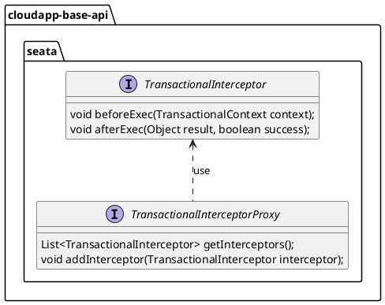

# 事务管理设计与使用

# 设计说明

事务管理是基于 [seata](https://seata.apache.org/zh-cn/) 进行设计实现。在 seata 原有能力基础上，增强了 seata 在可观测层面的能力。通过切面编程对 seata 中 _**@GlobalTransactional**_  注解插入事务处理，以及与 OpenTelemetry 集成，来采集 seata 中事务的相关指标。


事务管理抽象设计如下：



1.  定义事务拦截器接口 _**TransactionalInterceptor**_ ，主要方法有：
    
    1.  _**beforeExec(TransactionalContext context)**_ 在 _**@GlobalTransactional**_  注解之前执行的逻辑；
        
    2.  _**afterExec(Object result, boolean success)**_ 在 _**@GlobalTransactional**_  注解之后执行的逻辑；
        
2.  定义事务拦截器接口代理 _**TransactionalInterceptorProxy**_ ，主要方法有：
    
    1.  _**getInterceptors()**_ 获取 _**@GlobalTransactional**_  事务拦截器；
        
    2.  _**addInterceptor(TransactionalInterceptor interceptor)**_ 添加 _**@GlobalTransactional**_  事务拦截器；
        

# 使用说明

事务管理实现的配置如下：


1.  定义 seata 自动配置类 _**CloudAppSeataAutoConfiguration**_ ，用于自动配置 seata，主要方法：
    
    1.  _**seataProperties()**_ ，方法返回 _**io.seata.spring.boot.autoconfigure.properties.SeataProperties**_ ，使用注解 _**@ConfigurationProperties(prefix = "com.alibaba.cloudapp.seata")**_ 标记方法， _**SeataProperties**_  类字段如下：
        

|  **字段名**  |  **数据类型**  |  **默认值**  |  **备注**  |
| --- | --- | --- | --- |
|  enabled  |  boolean  |  true  |  是否启用  |
|  applicationId  |  String  |  \-  |  应用 id  |
|  txServiceGroup  |  String  |  \-  |  事务分组  |
|  enableAutoDataSourceProxy  |  boolean  |  true  |  是否启用数据源bean的自动代理  |
|  dataSourceProxyMode  |  String  |  AT  |  数据源代理模式，可选值：AT、TCC、SAGA、XA  |
|  useJdkProxy  |  useJdkProxy  |  false  |  是否使用JDK代理，而不是CGLIB代理  |
|  scanPackages  |  String\[\]  |  \-  |  扫描包。如果为空，将扫描所有 bean。  |
|  excludesForScanning  |  String\[\]  |  \-  |  指定不会在 GlobalTransactionScanner 中扫描的 beans  |
|  excludesForAutoProxying  |  String\[\]  |  \-  |  指定哪个数据源 bean 不符合自动代理的条件  |
|  accessKey  |  String  |  \-  |  阿里云环境 seata 服务访问凭证AK，其他环境无需配置  |
|  secretKey  |  String  |  \-  |  阿里云环境 seata 服务访问凭证SK，其他环境无需配置  |

2.  定义 seata 可观测能力自动配置类 _**SeataObservableConfiguration**_ ，用于自动配置 seata 可观测能力；
    
3.  定义 seata saga 事务模式自动配置类 _**CloudAppSagaAutoConfiguration**_ ，用于自动配置 seata saga 事务模式，使用注解 **@ConditionalOnProperty({"com.alibaba.cloudapp.seata.enabled","com.alibaba.cloudapp.seata.saga.enabled"})** 标记类，主要方法有：
    
    1.  _**dbStateMachineConfig**_ 数据库状态机配置，使用注解 _**@ConfigurationProperties(prefix = "com.alibaba.cloudapp.seata.saga.state-machine")**_ 标记方法；
        
    2.  _**sagaAsyncThreadPoolProperties**_ saga异步线程池参数，使用注解 _**@ConfigurationProperties("com.alibaba.cloudapp.seata.saga.async-thread-pool")**_ 标记方法，返回 _**io.seata.spring.boot.autoconfigure.properties.SagaAsyncThreadPoolProperties**_ 类实例， _**SagaAsyncThreadPoolProperties**_ 类字段如下：
        

|  **字段名**  |  **数据类型**  |  **默认值**  |  **备注**  |
| --- | --- | --- | --- |
|  corePoolSize  |  int  |  1  |  活动状态的最小工作线程数量  |
|  maxPoolSize  |  int  |  20  |  最大线程数量  |
|  keepAliveTime  |  int  |  60  |  等待工作的空闲线程的超时时间  |

4.  定义 seata 可观测指标采集类 _**GlobalTransactionHolder**_ ，主要代码如下：
    

```java
@MetricCollection
@Scope(ConfigurableBeanFactory.SCOPE_SINGLETON)
public class GlobalTransactionHolder {
    @Metric(name="seata.transactional.counter")
    private long count;
    
    @Metric(name="seata.transactional.succeed.counter")
    private long succeedCount;
    
    @Metric(name="seata.transactional.failed.counter")
    private long failedCount;
    
    @Metric(name="seata.transactional.running.gauge", type = MetricType.GAUGE)
    private long runningGauge;
    
    @Metric(name="seata.transactional.max.running.time",
            type = MetricType.GAUGE, unit = "ms")
    private long maxRunningTime;
    
    @Metric(name="seata.transactional.min.running.time",
            type = MetricType.GAUGE, unit = "ms")
    private long minRunningTime;
    
    
}
```


## 场景一：seata AT 事务模式

此场景代码在代码仓库的 `cloudapp-seata-demo-at` 模块。

### POM 配置

在依赖中引入事务管理的实现和可观测的实现。

```xml
……
<dependencyManagement>
    <dependencies>
        <dependency>
            <groupId>${cloudapp.groupId}</groupId>
            <artifactId>cloudapp-framework-dependencies</artifactId>
            <scope>import</scope>
            <version>${revision}</version>
            <type>pom</type>
        </dependency>
    </dependencies>
</dependencyManagement>

<dependencies>

    <dependency>
        <groupId>${cloudapp.groupId}</groupId>
        <artifactId>spring-boot-starter-cloudapp</artifactId>
    </dependency>

    <dependency>
        <groupId>${cloudapp.groupId}</groupId>
        <artifactId>cloudapp-spring-seata</artifactId>
    </dependency>

    <dependency>
        <groupId>org.springframework.boot</groupId>
        <artifactId>spring-boot-starter-web</artifactId>
    </dependency>

    <dependency>
        <groupId>com.baomidou</groupId>
        <artifactId>mybatis-plus-boot-starter</artifactId>
        <version>3.4.3</version>
    </dependency>

    <dependency>
        <groupId>com.fasterxml.jackson.core</groupId>
        <artifactId>jackson-databind</artifactId>
    </dependency>

    <dependency>
        <groupId>${cloudapp.groupId}</groupId>
        <artifactId>cloudapp-observabilities-opentelemetry</artifactId>
    </dependency>

    <dependency>
        <groupId>org.projectlombok</groupId>
        <artifactId>lombok</artifactId>
        <optional>true</optional>
    </dependency>

    <dependency>
        <groupId>com.mysql</groupId>
        <artifactId>mysql-connector-j</artifactId>
    </dependency>

</dependencies>
……
```

### 应用配置

已连接 mysql 数据源为例，在项目资源目录中，创建下方三个应用配置文件，分别为： `application.yml` 、 `file.conf` 、 `registry.conf` 。

`application.yml` 文件中配置开启 seata 事务管理可观测能力。其中 `${host}` 、 `${username}` 和 `${password}` 指 mysql 链接地址、用户名和密码，从环境变量获取对应值。 `${spring.application.name}` 是指  `spring.application.name` 这个配置属性的值， `${endpoint}` 是指 OpenTelemetry 指标上报端点，从环境变量获取对应值。

application.yml 文件如下：

```yaml
server:
  port: 8080

spring:
  application:
    name: cloudapp-seata-demo-at
  datasource:
    driver-class-name: com.mysql.cj.jdbc.Driver
    url: jdbc:mysql://${host}:3306/at_test?allowPublicKeyRetrieval=true&useSSL=false&useUnicode=true&characterEncoding=UTF8
    username: ${username}
    password: ${password}
    type: com.alibaba.druid.pool.DruidDataSource

  main:
    allow-circular-references: true

io:
  cloudapp:
    seata:
      enabled: true
      application-id: ${spring.application.name}
      tx-service-group: ${spring.application.name}-tx-group

    observabilities:
      ot:
        enabled: true
        metric-endpoint: ${endpoint}
logging:
  level:
    org: info

```

file.conf 文件如下：

```yaml
transport {
  # tcp, unix-domain-socket
  type = "TCP"
  #NIO, NATIVE
  server = "NIO"
  #enable heartbeat
  heartbeat = true
  # the tm client batch send request enable
  enableTmClientBatchSendRequest = false
  # the rm client batch send request enable
  enableRmClientBatchSendRequest = true
   # the rm client rpc request timeout
  rpcRmRequestTimeout = 2000
  # the tm client rpc request timeout
  rpcTmRequestTimeout = 30000
  # the rm client rpc request timeout
  rpcRmRequestTimeout = 15000
  #thread factory for netty
  threadFactory {
    bossThreadPrefix = "NettyBoss"
    workerThreadPrefix = "NettyServerNIOWorker"
    serverExecutorThread-prefix = "NettyServerBizHandler"
    shareBossWorker = false
    clientSelectorThreadPrefix = "NettyClientSelector"
    clientSelectorThreadSize = 1
    clientWorkerThreadPrefix = "NettyClientWorkerThread"
    # netty boss thread size
    bossThreadSize = 1
    #auto default pin or 8
    workerThreadSize = "default"
  }
  shutdown {
    # when destroy server, wait seconds
    wait = 3
  }
  serialization = "seata"
  compressor = "none"
}
service {
  #transaction service group mapping
  vgroupMapping.cloudapp-seata-demo-at-tx-group = "default"
  #only support when registry.type=file, please don't set multiple addresses
  default.grouplist = "127.0.0.1:8091"
  #degrade, current not support
  enableDegrade = false
  #disable seata
  disableGlobalTransaction = false
}

client {
  rm {
    asyncCommitBufferLimit = 10000
    lock {
      retryInterval = 10
      retryTimes = 30
      retryPolicyBranchRollbackOnConflict = true
    }
    reportRetryCount = 5
    tableMetaCheckEnable = false
    tableMetaCheckerInterval = 60000
    reportSuccessEnable = false
    sagaBranchRegisterEnable = false
    sagaJsonParser = "fastjson"
    sagaRetryPersistModeUpdate = false
    sagaCompensatePersistModeUpdate = false
    tccActionInterceptorOrder = -2147482648 #Ordered.HIGHEST_PRECEDENCE + 1000
    sqlParserType = "druid"
    branchExecutionTimeoutXA = 60000
    connectionTwoPhaseHoldTimeoutXA = 10000
  }
  tm {
    commitRetryCount = 5
    rollbackRetryCount = 5
    defaultGlobalTransactionTimeout = 60000
    degradeCheck = false
    degradeCheckPeriod = 2000
    degradeCheckAllowTimes = 10
    interceptorOrder = -2147482648 #Ordered.HIGHEST_PRECEDENCE + 1000
  }
  undo {
    dataValidation = true
    onlyCareUpdateColumns = true
    logSerialization = "jackson"
    logTable = "undo_log"
    compress {
      enable = true
      # allow zip, gzip, deflater, lz4, bzip2, zstd default is zip
      type = zip
      # if rollback info size > threshold, then will be compress
      # allow k m g t
      threshold = 64k
    }
  }
  loadBalance {
      type = "XID"
      virtualNodes = 10
  }
}
log {
  exceptionRate = 100
}
tcc {
  fence {
    # tcc fence log table name
    logTableName = tcc_fence_log
    # tcc fence log clean period
    cleanPeriod = 1h
  }
}

```

registry.conf 文件如下：

```yaml
registry {
  # file 、nacos 、eureka、redis、zk、consul、etcd3、sofa、custom
  type = "file"
  file {
    name = "file.conf"
  }
}

config {
  # file、nacos 、apollo、zk、consul、etcd3、springCloudConfig、custom
  type = "file"
  file {
    name = "file.conf"
  }
}

```

### 使用验证

示例主要类如下，通过 _**@GlobalTransactional**_  声明 seata 全局事务。

```java
@Service
public class BusinessServiceImpl implements BusinessService {

    private static final Logger LOGGER = LoggerFactory.getLogger(BusinessService.class);

    @Resource
    private StockService stockService;
    @Resource
    private OrderService orderService;
    @Resource
    private AccountService accountService;

    private final Random random = new Random();

    @Override
    @GlobalTransactional(timeoutMills = 300000, name = "cloudapp-seata-at")
    public void buy(String userId, String productCode, int count) {
        LOGGER.info("purchase begin ... xid: " + RootContext.getXID());
        
        stockService.debit(productCode, count);
        Order order = orderService.create(userId, productCode, count);
        accountService.debit(userId, order.getAmount());
        
        if (random.nextBoolean()) {
            throw new RuntimeException("random exception!");
        }
    }

}
```

运行并请求 `cloudapp-seata-demo-at` 模块 demo 中  `/buy` 端点，即可在 Otel 中查看 seata 监控指标：


## 场景二：seata SAGA 事务模式

此场景代码在代码仓库的  `cloudapp-seata-demo-saga` 模块。

### POM 配置

在依赖中引入事务管理的实现和可观测的实现。

```xml
……
<dependencyManagement>
    <dependencies>
        <dependency>
            <groupId>${cloudapp.groupId}</groupId>
            <artifactId>cloudapp-framework-dependencies</artifactId>
            <scope>import</scope>
            <version>${revision}</version>
            <type>pom</type>
        </dependency>
    </dependencies>
</dependencyManagement>

<dependencies>

    <dependency>
        <groupId>${cloudapp.groupId}</groupId>
        <artifactId>spring-boot-starter-cloudapp</artifactId>
    </dependency>

    <dependency>
        <groupId>${cloudapp.groupId}</groupId>
        <artifactId>cloudapp-spring-seata</artifactId>
    </dependency>

    <dependency>
        <groupId>org.springframework.boot</groupId>
        <artifactId>spring-boot-starter-web</artifactId>
    </dependency>

    <dependency>
        <groupId>org.springframework.boot</groupId>
        <artifactId>spring-boot-starter-data-jpa</artifactId>
    </dependency>

    <dependency>
        <groupId>${cloudapp.groupId}</groupId>
        <artifactId>cloudapp-observabilities-opentelemetry</artifactId>
    </dependency>

    <dependency>
        <groupId>org.projectlombok</groupId>
        <artifactId>lombok</artifactId>
        <optional>true</optional>
    </dependency>

    <dependency>
        <groupId>com.mysql</groupId>
        <artifactId>mysql-connector-j</artifactId>
    </dependency>

</dependencies>
……
```

### 应用配置

已连接 mysql 数据源为例，在项目资源目录中，创建下方 4 个应用配置文件，分别为： `application.yml` 、 `file.conf` 、 `registry.conf` 和状态图 JSON 文件  `buy_state.json` 。

`application.yml` 文件中配置开启 seata 事务管理可观测能力。其中 `${host}` 、 `${username}` 和 `${password}` 指 mysql 链接地址、用户名和密码，从环境变量获取对应值。 `${spring.application.name}` 是指  `spring.application.name` 这个配置属性的值， `${endpoint}` 是指 OpenTelemetry 指标上报端点，从环境变量获取对应值。

application.yml 文件如下：

```yaml
server:
  port: 8080

spring:
  application:
    name: seata-demo
  datasource:
    driver-class-name: com.mysql.cj.jdbc.Driver
    url: jdbc:mysql://${host}:3306/saga_test?allowPublicKeyRetrieval=true&useSSL=false&useUnicode=true&characterEncoding=UTF8
    username: ${username}
    password: ${password}
    type: com.alibaba.druid.pool.DruidDataSource

  main:
    allow-circular-references: true
  jpa:
    show-sql: true
    hibernate:
      ddl-auto: update

io:
  cloudapp:
    seata:
      enabled: true
      application-id: ${spring.application.name}
      tx-service-group: ${spring.application.name}-tx-group
      dataSourceProxyMode: SAGA
      saga:
        enabled: true
        state-machine:
          async-thread-pool:
            core-pool-size: 10
            max-pool-size: 20
            keep-alive-time: 60
          enable-async: true
          auto-register-resources: true
          charset: UTF-8
          trans-operation-timeout: 1800000
          resources: classpath:seata/statelang/statelang/*.json
          #table-prefix: saga_
          #default-tenant-id: 1
          service-invoke-timeout: 300000

    observabilities:
      ot:
        enabled: true
        metric-endpoint: ${endpoint}
```

file.conf 文件如下：

```yaml
transport {
  # tcp, unix-domain-socket
  type = "TCP"
  #NIO, NATIVE
  server = "NIO"
  #enable heartbeat
  heartbeat = true
  # the tm client batch send request enable
  enableTmClientBatchSendRequest = false
  # the rm client batch send request enable
  enableRmClientBatchSendRequest = true
   # the rm client rpc request timeout
  rpcRmRequestTimeout = 2000
  # the tm client rpc request timeout
  rpcTmRequestTimeout = 30000
  # the rm client rpc request timeout
  rpcRmRequestTimeout = 15000
  #thread factory for netty
  threadFactory {
    bossThreadPrefix = "NettyBoss"
    workerThreadPrefix = "NettyServerNIOWorker"
    serverExecutorThread-prefix = "NettyServerBizHandler"
    shareBossWorker = false
    clientSelectorThreadPrefix = "NettyClientSelector"
    clientSelectorThreadSize = 1
    clientWorkerThreadPrefix = "NettyClientWorkerThread"
    # netty boss thread size
    bossThreadSize = 1
    #auto default pin or 8
    workerThreadSize = "default"
  }
  shutdown {
    # when destroy server, wait seconds
    wait = 3
  }
  serialization = "seata"
  compressor = "none"
}
service {
  #transaction service group mapping
  vgroupMapping.seata-demo-tx-group = "default"
  #only support when registry.type=file, please don't set multiple addresses
  default.grouplist = "127.0.0.1:8091"
  #degrade, current not support
  enableDegrade = false
  #disable seata
  disableGlobalTransaction = false
}

client {
  rm {
    asyncCommitBufferLimit = 10000
    lock {
      retryInterval = 10
      retryTimes = 30
      retryPolicyBranchRollbackOnConflict = true
    }
    reportRetryCount = 5
    tableMetaCheckEnable = false
    tableMetaCheckerInterval = 60000
    reportSuccessEnable = false
    sagaBranchRegisterEnable = false
    sagaJsonParser = "fastjson"
    sagaRetryPersistModeUpdate = false
    sagaCompensatePersistModeUpdate = false
    tccActionInterceptorOrder = -2147482648 #Ordered.HIGHEST_PRECEDENCE + 1000
    sqlParserType = "druid"
    branchExecutionTimeoutXA = 60000
    connectionTwoPhaseHoldTimeoutXA = 10000
  }
  tm {
    commitRetryCount = 5
    rollbackRetryCount = 5
    defaultGlobalTransactionTimeout = 60000
    degradeCheck = false
    degradeCheckPeriod = 2000
    degradeCheckAllowTimes = 10
    interceptorOrder = -2147482648 #Ordered.HIGHEST_PRECEDENCE + 1000
  }
  undo {
    dataValidation = true
    onlyCareUpdateColumns = true
    logSerialization = "jackson"
    logTable = "undo_log"
    compress {
      enable = true
      # allow zip, gzip, deflater, lz4, bzip2, zstd default is zip
      type = zip
      # if rollback info size > threshold, then will be compress
      # allow k m g t
      threshold = 64k
    }
  }
  loadBalance {
      type = "XID"
      virtualNodes = 10
  }
}
log {
  exceptionRate = 100
}
saga{
  enable = true
}
```

registry.conf 文件如下：

```yaml
registry {
  # file 、nacos 、eureka、redis、zk、consul、etcd3、sofa、custom
  type = "file"
  file {
    name = "file.conf"
  }
}

config {
  # file、nacos 、apollo、zk、consul、etcd3、springCloudConfig、custom
  type = "file"
  file {
    name = "file.conf"
  }
}

```

buy\_state.json 文件如下：

```json
{
  "Name": "SagaDemoMachine",
  "Comment": "This state machine is modeled by designer tools.",
  "Version": "0.0.5",
  "StartState": "StockServiceTask",
  "States": {
    "StockServiceTask": {
      "Name": "StockServiceTask",
      "CompensateState": "StockCompensate",
      "Input": [
        "$.[businessKey]",
        "$.[productCode]",
        "$.[count]"
      ],
      "Output": {
        "StockDebitResult": "$.#root"
      },
      "Status": {
        "#root == true": "SU",
        "#root == false": "FA",
        "$Exception{java.lang.Throwable}": "UN"
      },
      "ServiceName": "stockService",
      "ServiceMethod": "debit",
      "Type": "ServiceTask",
      "Next": "StockChoice",
      "Catch": [
        {
          "Exceptions": [ "java.lang.Throwable" ],
          "Next": "CompensationTrigger"
        }
      ]
    },
    "StockCompensate": {
      "Name": "StockCompensate",
      "Input": [
        "$.[businessKey]"
      ],
      "ServiceName": "stockService",
      "ServiceMethod": "compensate",
      "Type": "ServiceTask"
    },
    "StockChoice": {
      "Name": "StockChoice",
      "Type": "Choice",
      "Choices": [
        {
          "Expression": "[StockDebitResult] == true",
          "Next": "OrderServiceTask"
        }
      ],
      "Default": "Fail"
    },
    "OrderServiceTask": {
      "Name": "OrderServiceTask",
      "CompensateState": "OrderCompensate",
      "Input": [
        "$.[businessKey]",
        "$.[userId]",
        "$.[productCode]",
        "$.[count]"
      ],
      "Output": {
        "CreateOrderResult": "$.#root"
      },
      "Status": {
        "#root != null": "SU",
        "#root == null": "FA",
        "$Exception{java.lang.Throwable}": "UN"
      },
      "ServiceName": "orderService",
      "ServiceMethod": "create",
      "Catch": [
        {
          "Exceptions": [ "java.lang.Throwable" ],
          "Next": "CompensationTrigger"
        }
      ],
      "Type": "ServiceTask",
      "Next": "OrderChoice"
    },
    "OrderCompensate": {
      "Name": "OrderCompensate",
      "Input": [
        "$.[businessKey]"
      ],
      "ServiceName": "orderService",
      "ServiceMethod": "compensate",
      "Type": "ServiceTask"
    },
    "OrderChoice": {
      "Name": "OrderChoice",
      "Type": "Choice",
      "Choices": [
        {
          "Expression": "[CreateOrderResult] != null",
          "Next": "AccountServiceTask"
        }
      ],
      "Default": "Fail"
    },
    "AccountServiceTask": {
      "Name": "AccountServiceTask",
      "CompensateState": "AccountCompensate",
      "Input": [
        "$.[businessKey]",
        "$.[userId]",
        "$.[amount]"
      ],
      "Output": {
        "DebitAccountResult": "$.#root"
      },
      "Status": {
        "#root == true": "SU",
        "#root == false": "FA",
        "$Exception{java.lang.Throwable}": "UN"
      },
      "ServiceName": "accountService",
      "ServiceMethod": "debit",
      "Catch": [
        {
          "Exceptions": [ "java.lang.Throwable" ],
          "Next": "CompensationTrigger"
        }
      ],
      "Type": "ServiceTask",
      "Next": "Succeed"
    },
    "AccountCompensate": {
      "Name": "AccountCompensate",
      "Input": [
        "$.[businessKey]"
      ],
      "ServiceName": "accountService",
      "ServiceMethod": "compensate",
      "Type": "ServiceTask"
    },
    "Succeed": {
      "Name": "Succeed",
      "Type": "Succeed"
    },
    "CompensationTrigger": {
      "Name": "CompensationTrigger",
      "Type": "CompensationTrigger",
      "Next": "Fail"
    },
    "Fail": {
      "Name": "Fail",
      "ErrorCode": "FAIL",
      "Message": "Buy Fail",
      "Type": "Fail"
    }
  }
}
```

### 使用验证

示例主要类如下，通过 _**StateMachineInstance**_  状态机来启动声明 seata 全局事务。

```java
@Service
public class BusinessServiceImpl implements BusinessService {

    private static final Logger LOGGER = LoggerFactory.getLogger(BusinessService.class);
    
    private static final String MACHINE_NAME = "SagaDemoMachine";
    private static final String TENANT_ID = "";

    @Resource
    private StockService stockService;
    @Autowired
    private StateMachineEngine stateMachineEngine;

    private final Random random = new Random();

    @Override
    public String buy(String userId, String productCode, int count) {
        String businessKey = String.valueOf(System.currentTimeMillis());
        
        Stock stock = stockService.findByProductCode(productCode);
        
        if(stock == null) {
            throw new RuntimeException("product: " + productCode + " not exist");
        }
        
        Map<String, Object> params = new HashMap<>();
        params.put("userId", userId);
        params.put("productCode", productCode);
        params.put("count", count);
        params.put("amount",  stock.getPrice().multiply(new BigDecimal(count)));
        params.put("businessKey", businessKey);
        
        DemoAsyncCallback callback = new DemoAsyncCallback();
        
        StateMachineInstance instance = stateMachineEngine.startWithBusinessKeyAsync(
                MACHINE_NAME, TENANT_ID, businessKey, params, callback);
        
        LOGGER.info("purchase begin ... xid: " + RootContext.getXID());
        
        callback.waitingForFinish(instance);
        
        return businessKey;
    }

}
```

运行并请求 `cloudapp-seata-demo-saga` 模块 demo 中  `/buy` 端点，即可在 Otel 中查看 seata 监控指标：

