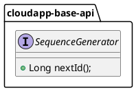

# 全局序列设计与使用

# 设计说明

全局序列主要给分布式系统的每个对象生成全局唯一的ID，框架默认支持唯一 ID 生成器 ，常见中的算法有两种，第一种是通过本地生成算法：如 [雪花算法](https://github.com/twitter-archive/snowflake) ；还有一种实现是依赖一个分布式服务，如 Redis。在 Cloud App 的设计中，默认提供这两种实现。

全局序列抽象设计如下：



1.  定义了全局序列生成接口 _**SequenceGenerator**_ ，主要方法有：
    
    1.   _**nextId()**_ 用于生成唯一ID；
        

# 使用说明

## 配置说明


1.  定义Redis 全局序列生成器的配置参数类 _**RedisSequenceProperties**_ ，继承类 _**org.springframework.boot.autoconfigure.data.redis.RedisProperties**_ ，使用注解 _**@ConfigurationProperties(prefix = Constants.SEQUENCE\_CONFIG\_REDIS\_ROOT, ignoreInvalidFields = true)**_ ，其中 _**Constants.SEQUENCE\_CONFIG\_REDIS\_ROOT=com.alibaba.cloudapp.sequence.redis**_ ，配置参数类字段如下：
    

|  **字段名**  |  **数据类型**  |  **默认值**  |  **备注**  |
| --- | --- | --- | --- |
|  enabled  |  boolean  |  \-  |  是否启用  |
|  queueName  |  String  |  com.alibaba.cloudapp.default.queue  |  队列名称  |
|  step  |  Long  |  1L  |  自增步长  |

其他配置字段参见类 _**org.springframework.boot.autoconfigure.data.redis.RedisProperties**_ 。

2.  定义雪花算法全局序列生成器的配置参数类 _**SnowflakeProperties**_ ，使用注解 _**@ConfigurationProperties(prefix = Constants.SEQUENCE\_CONFIG\_SNOWFLAKE\_ROOT, ignoreInvalidFields = true)**_ ，其中 _**Constants.SEQUENCE\_CONFIG\_SNOWFLAKE\_ROOT=com.alibaba.cloudapp.sequence.snowflake**_ ，配置参数类字段如下：
    

|  **字段名**  |  **数据类型**  |  **默认值**  |  **备注**  |
| --- | --- | --- | --- |
|  enabled  |  boolean  |  \-  |  是否启用  |
|  workerId  |  Long  |  1  |  工作机器Id  |
|  workerIdBits  |  Long  |  5L  |  工作机器Id所占位数  |
|  sequenceBits  |  Long  |  10L  |  自增序列所占位数  |


## 场景一：使用CloudApp雪花算法生成全局序列

### 配置POM依赖

新建应用或存量应用，使用雪花算法生成全局序列时，直接引入CloudApp Starter和cloudapp-spring-sequence

```xml
<dependencyManagement>
    <dependencies>
        <dependency>
            <groupId>com.alibaba.cloudapp</groupId>
            <artifactId>cloudapp-framework-dependencies</artifactId>
            <version>${cloudapp.version}</version>
            <type>pom</type>
            <scope>import</scope>
        </dependency>
    </dependencies>
</dependencyManagement>
<dependencies>
    <dependency>
        <groupId>org.springframework.boot</groupId>
        <artifactId>spring-boot-starter</artifactId>
    </dependency>
    <dependency>
        <groupId>com.alibaba.cloudapp</groupId>
        <artifactId>spring-boot-starter-cloudapp</artifactId>
    </dependency>
    <dependency>
        <groupId>com.alibaba.cloudapp</groupId>
        <artifactId>cloudapp-spring-sequence</artifactId>
    </dependency>
</dependencies>
```

### 应用配置

新建应用或存量应用，应用配置中添加CloudApp雪花算法生成全局序列的属性，以工作机器id为1、工作机器id所占位数为5、自增序列所占位数为10作为示例配置如下：

```yaml
spring:
  application:
    name: demo

io:
  cloudapp:
    sequence:
      snowflake:
        # 启用雪花算法全局序列生成器
        enabled: true
        workerId: 1
        workerIdBits: 5
        sequenceBits: 10
```

### 使用及验证

新建应用或存量应用，使用SequenceGenerator实例调用nextId()方法生成全局序列

```java
package com.alibaba.cloudapp.sequence.demo;

import sequence.api.com.alibaba.cloudapp.SequenceGenerator;
import org.springframework.beans.factory.InitializingBean;
import org.springframework.beans.factory.annotation.Autowired;
import org.springframework.boot.SpringApplication;
import org.springframework.boot.autoconfigure.SpringBootApplication;

@SpringBootApplication
public class CloudappSequenceSnowflakeDemoApplication implements InitializingBean {

    @Autowired
    private SequenceGenerator sequenceGenerator;

    public static void main(String[] args) {
        SpringApplication.run(CloudappSequenceSnowflakeDemoApplication.class, args);

    }

    @Override
    public void afterPropertiesSet() {
        long start = System.currentTimeMillis();
        for (int i = 0 ; i < 1000; i++) {
            System.out.println("Loop generating sequence id: " + sequenceGenerator.nextId());
        }
    }
}

```

执行后输出1000个随机生成的全局序列，并输出耗时，如下


## 场景二：已用Redis，将用Redis创建全局序列

存量应用已整合Redis，并引入相关依赖包。接下来，我们将使用CloudApp基于Redis的全局序列。

### 配置POM依赖

存量应用之前已使用了Redis，现在需要使用Redis来生成全局序列，则只需要新增引入Cloudapp的Starter与创建全局序列的依赖。

```xml
<dependencyManagement>
    <dependencies>
        <dependency>
            <groupId>com.alibaba.cloudapp</groupId>
            <artifactId>cloudapp-framework-dependencies</artifactId>
            <version>1.0.0</version>
            <type>pom</type>
            <scope>import</scope>
        </dependency>
    </dependencies>
</dependencyManagement>
<dependencies>
    <!-- 使用CloudApp 通过Redis生成全局序列时，应用需要新增的依赖 -->
    <dependency>
        <groupId>com.alibaba.cloudapp</groupId>
        <artifactId>spring-boot-starter-cloudapp</artifactId>
    </dependency>
    <dependency>
        <groupId>com.alibaba.cloudapp</groupId>
        <artifactId>cloudapp-spring-sequence</artifactId>
    </dependency>
    <!--  -->
  
    <!-- 应用之前已使用的redis相关依赖 -->
    <dependency>
        <groupId>org.springframework.boot</groupId>
        <artifactId>spring-boot-starter-data-redis</artifactId>
    </dependency>
</dependencies>
```

### 应用配置

以使用之前已配置的Redis去创建全局序列为例，配置如下：

```yaml
spring:
  application:
    name: demo
  redis:
    host: ${REDIS_HOST}
```

### 使用及验证

定义配置类，用于返回Redis全局序列生成器。

```java
package com.alibaba.cloudapp.sequence.demo.configuration;


import sequence.api.com.alibaba.cloudapp.SequenceGenerator;
import sequence.com.alibaba.cloudapp.Constants;
import service.sequence.com.alibaba.cloudapp.RedisSequenceGenerator;
import org.springframework.beans.factory.annotation.Qualifier;
import org.springframework.context.annotation.Bean;
import org.springframework.context.annotation.Configuration;
import org.springframework.data.redis.core.RedisTemplate;

@Configuration
public class CommonRedisConfiguration {


    @Bean("commonRedisGenerator")
    public SequenceGenerator getFirstQueue(
            @Qualifier("redisTemplate") RedisTemplate<Object, Object> redisTemplate
    ) {
        return new RedisSequenceGenerator(redisTemplate, Constants.DEFAULT_QUEUE_NAME, 1L);
    }

}

```

使用Redis全局序列生成器创建全局序列：

```java
package com.alibaba.cloudapp.sequence.demo;

import sequence.api.com.alibaba.cloudapp.SequenceGenerator;
import org.springframework.beans.factory.InitializingBean;
import org.springframework.beans.factory.annotation.Autowired;
import org.springframework.boot.SpringApplication;
import org.springframework.boot.autoconfigure.SpringBootApplication;

@SpringBootApplication
public class CloudappSequenceCommonRedisApplication implements InitializingBean {

    @Autowired
    SequenceGenerator sequenceGenerator;

    public static void main(String[] args) {
        SpringApplication.run(CloudappSequenceCommonRedisApplication.class, args);
    }

    @Override
    public void afterPropertiesSet() throws Exception {
        System.out.println(sequenceGenerator.nextId());
    }
}

```

## 场景三：同时使用雪花算法和基于Redis实现生成全局序列

新建应用，同时使用雪花算法和基于Redis实现生成全局序列。

### 配置POM依赖

引入CloudApp核心框架、CloudApp全局序列、Redis数据这些依赖

```xml
<dependencyManagement>
    <dependencies>
        <dependency>
            <groupId>com.alibaba.cloudapp</groupId>
            <artifactId>cloudapp-framework-dependencies</artifactId>
            <version>1.0.0</version>
            <type>pom</type>
            <scope>import</scope>
        </dependency>
    </dependencies>
</dependencyManagement>
<dependencies>
    <dependency>
        <groupId>org.springframework.boot</groupId>
        <artifactId>spring-boot-starter</artifactId>
    </dependency>
    <dependency>
        <groupId>com.alibaba.cloudapp</groupId>
        <artifactId>spring-boot-starter-cloudapp</artifactId>
    </dependency>
    <dependency>
        <groupId>com.alibaba.cloudapp</groupId>
        <artifactId>cloudapp-spring-sequence</artifactId>
    </dependency>
    <dependency>
        <groupId>org.springframework.data</groupId>
        <artifactId>spring-data-redis</artifactId>
    </dependency>
    <dependency>
        <groupId>redis.clients</groupId>
        <artifactId>jedis</artifactId>
    </dependency>
</dependencies>
```

### 应用配置

在应用配置中同时启用雪花算法、基于Redis实现这2种方式生成全局序列

```yaml
spring:
  application:
    name: demo

io:
  cloudapp:
    sequence:
      snowflake:
        # 启用基于雪花算法方式生成全局序列
        enabled: true
        workerId: 1
        workerIdBits: 5
        sequenceBits: 10
      redis:
        # 启用基于Redis实现生成全局序列
        enabled: true
        host: ${REDIS_HOST}
```

### 使用及验证

```java
package com.alibaba.cloudapp.sequence.demo;

import sequence.api.com.alibaba.cloudapp.SequenceGenerator;
import org.springframework.beans.factory.InitializingBean;
import org.springframework.beans.factory.annotation.Autowired;
import org.springframework.beans.factory.annotation.Qualifier;
import org.springframework.boot.SpringApplication;
import org.springframework.boot.autoconfigure.SpringBootApplication;

@SpringBootApplication
public class CloudappSequenceMixDemoApplication implements InitializingBean {

    @Autowired
    @Qualifier("snowflakeSequence")
    private SequenceGenerator snowflakeGenerator;

    @Autowired
    @Qualifier("redisSequence")
    private SequenceGenerator redisGenerator;

    public static void main(String[] args) {
        SpringApplication.run(CloudappSequenceMixDemoApplication.class, args);
    }

    @Override
    public void afterPropertiesSet() {
        System.out.println("Snowflake generated sequence id: " + snowflakeGenerator.nextId());
        System.out.println("Redis generated sequence id: " + redisGenerator.nextId());

    }
}

```

## 场景四：创建多个队列生成全局序列

新建应用或存量应用，在使用基于Redis创建全局序列时，定义多个全局序列队列，每个队列用于创建不同的全局序列。

### 配置POM依赖

引入CloudApp核心框架、CloudApp全局序列、Redis数据这些依赖

```xml
<dependencyManagement>
    <dependencies>
        <dependency>
            <groupId>com.alibaba.cloudapp</groupId>
            <artifactId>cloudapp-framework-dependencies</artifactId>
            <version>1.0.0</version>
            <type>pom</type>
            <scope>import</scope>
        </dependency>
    </dependencies>
</dependencyManagement>
<dependencies>
    <dependency>
        <groupId>org.springframework.boot</groupId>
        <artifactId>spring-boot-starter</artifactId>
    </dependency>
    <dependency>
        <groupId>com.alibaba.cloudapp</groupId>
        <artifactId>spring-boot-starter-cloudapp</artifactId>
    </dependency>
    <dependency>
        <groupId>com.alibaba.cloudapp</groupId>
        <artifactId>cloudapp-spring-sequence</artifactId>
    </dependency>
    <dependency>
        <groupId>org.springframework.data</groupId>
        <artifactId>spring-data-redis</artifactId>
    </dependency>
    <dependency>
        <groupId>redis.clients</groupId>
        <artifactId>jedis</artifactId>
    </dependency>
</dependencies>
```

### 应用配置

```yaml
spring:
  application:
    name: demo

io:
  cloudapp:
    sequence:
      redis:
        enabled: true
        host: ${REDIS_HOST}

```

### 使用及验证

定义配置类，然后定义多个队列。

```java
package com.alibaba.cloudapp.sequence.demo.configuration;


import sequence.api.com.alibaba.cloudapp.SequenceGenerator;
import service.sequence.com.alibaba.cloudapp.RedisSequenceGenerator;
import org.springframework.context.annotation.Bean;
import org.springframework.context.annotation.Configuration;
import org.springframework.data.redis.core.RedisTemplate;

@Configuration
public class MultiQueueConfiguration {

    @Bean("firstQueueSequenceGenerator")
    public SequenceGenerator getFirstQueue(
            RedisTemplate<Object, Object> redisTemplate
    ) {
      // 定义名为firstQueue队列，并返回redis全局序列生成器
        return new RedisSequenceGenerator(redisTemplate, "firstQueue", 1L);
    }

  
    @Bean("secondQueueSequenceGenerator")
    public SequenceGenerator getSecondQueue(
            RedisTemplate<Object, Object> redisTemplate
    ) {
      // 定义名为secondQueue队列，并返回redis全局序列生成器
        return new RedisSequenceGenerator(redisTemplate, "secondQueue", 1L);
    }

}

```

使用redis全局序列生成器创建全局序列，通过指定bean名字来使用不同队列创建全局序列。

```java
package com.alibaba.cloudapp.sequence.demo;

import sequence.api.com.alibaba.cloudapp.SequenceGenerator;
import service.sequence.com.alibaba.cloudapp.RedisSequenceGenerator;
import org.springframework.beans.factory.InitializingBean;
import org.springframework.beans.factory.annotation.Autowired;
import org.springframework.beans.factory.annotation.Qualifier;
import org.springframework.boot.SpringApplication;
import org.springframework.boot.autoconfigure.SpringBootApplication;

@SpringBootApplication
public class CloudappSequenceMultiQueuesApplication implements InitializingBean {

    @Autowired
    @Qualifier("firstQueueSequenceGenerator")
    private SequenceGenerator firstGenerator;

    @Autowired
    @Qualifier("secondQueueSequenceGenerator")
    private SequenceGenerator secondGenerator;

    public static void main(String[] args) {
        SpringApplication.run(CloudappSequenceMultiQueuesApplication.class, args);
    }

    @Override
    public void afterPropertiesSet() {

        System.out.println("Generated first queue sequence id: " + firstGenerator.nextId());
        System.out.println("Generated second queue sequence id: " + secondGenerator.nextId());
        
}

```