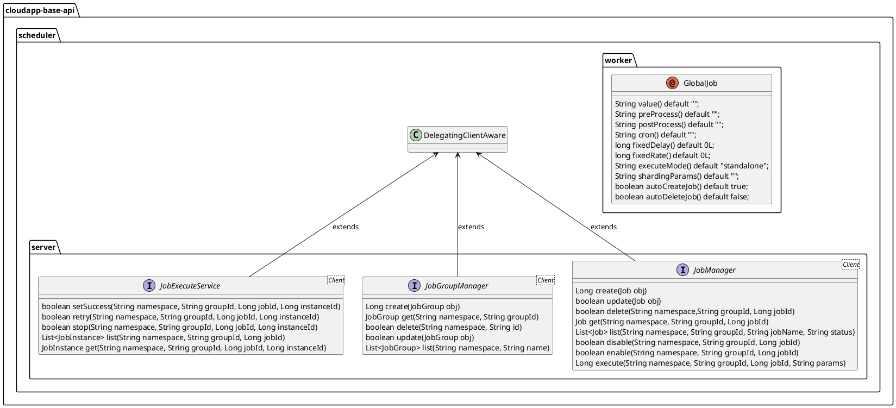

# 分布式任务设计与使用

# 设计说明

Framework 分布式任务是基于 SchedulerX2 和 XXL-JOB 进行抽象设计，期望通过统一的抽象满足两者的基础用例场景；高阶用例场景，通过接口实现的委托类来调用底层原生 SDK 来满足。

在 Framework 中，将接口抽象为 server 侧和 worker 侧两类即对应管控链路和业务链路。worker 侧接口更多用于业务链路，它提供给开发者在业务处理中使用。通过注解 _**@GlobalJob**_ 统一多平台任务定义方式、_**GlobalJobHelper**_ 类统一任务参数管理，支持定义各类任务如：定时任务、延时任务等，并支持自动创建、自动删除任务。server 侧接口更多用于管控链路，主要用于服务的管理而非业务处理，支持任务组等任务等管理操作。


分布式任务抽象设计如下：



1.  定义任务注解 _**GlobalJob**_ ，用于创建任务，主要参数有：
    
    1.  _**value**_ 配置生成的任务名，不指定则任务名默认为当前方法名。
        
    2.  _**preProcess**_ 配置任务执行前的操作，填写方法名，默认为空。
        
    3.  _**postProcess**_ 配置任务执行后的操作，填写方法名，默认为空。
        
    4.  _**cron**_ 使用Cron表达式调度任务，默认为空。
        
    5.  _**fixedDelay**_ 任务执行之间的固定延迟时间，单位为秒，默认为0。
        
    6.  _**fixedRate**_ 任务执行的固定频率，单位为秒，默认为0，且需大于60秒。
        
    7.  _**executeMode**_ 任务执行模式，支持单机(standalone)、广播(broadcast)和分片(sharding)，默认为单机。
        
    8.  _**shardingParams**_ 分片任务的分片参数，默认为空。
        
    9.  _**autoCreateJob**_ 是否在启动时自动创建并提交任务，默认为true。
        
    10.  _**autoDeleteJob**_ 是否在关闭时自动删除任务，默认为false。
        
    11.  _**description**_ 任务描述，默认为“Created from CloudApp framework”。
        
2.  定义任务组管理接口 _**JobGroupManager**_ ，（任务组概念在 SchedulerX2 中对应应用，在 XXL-JOB 中对应执行器）主要方法有：
    
    1.  _**create(JobGroup obj)**_ 创建任务组；
        
    2.  _**get(String namespace, String groupId)**_ 获取任务组；
        
    3.  _**delete(String namespace, String id)**_ 删除任务组；
        
    4.  _**update(JobGroup obj)**_ 更新任务组；
        
    5.  _**list(String namespace, String name)**_ 获取任务组列表；
        
3.  定于任务管理接口 _**JobManager**_ ，主要方法有：
    
    1.  _**create(Job obj)**_ 创建任务；
        
    2.  _**update(Job obj)**_ 更新任务；
        
    3.  _**delete(String namespace,String groupId, Long jobId)**_ 删除任务；
        
    4.  _**get(String namespace, String groupId, Long jobId)**_ 获取任务；
        
    5.  _**list(String namespace, String groupId, String jobName, String status)**_ 获取任务列表；
        
    6.  _**disable(String namespace, String groupId, Long jobId)**_ 禁用任务；
        
    7.  _**enable(String namespace, String groupId, Long jobId)**_ 启用任务；
        
    8.  _**execute(String namespace, String groupId, Long jobId, String params)**_ 运行任务；
        
4.  定义任务运行服务接口 _**JobExecuteService**_ ，主要方法有：
    
    1.  _**setSuccess(String namespace, String groupId, Long jobId, Long instanceId)**_ 标记任务实例为成功；
        
    2.  _**retry(String namespace, String groupId, Long jobId, Long instanceId)**_ 重新运行任务实例；
        
    3.  _**stop(String namespace, String groupId, Long jobId, Long instanceId)**_ 终止任务实例运行；
        
    4.  _**list(String namespace, String groupId, Long jobId)**_ 获取任务实例列表；
        
    5.  _**get(String namespace, String groupId,  Long jobId, Long instanceId)**_ 获取任务实例详情；
        

# 使用说明

## 配置说明
分布式任务实现的配置如下：

### SchedulerX2


1.  定义 Schedulerx2 server 自动配置参数类 _**SchedulerX2ServerProperties**_ ，使用注解 _**@ConfigurationProperties(prefix = "io.cloudapp.scheduler.schedulerx2-server")**_ ，字段如下：
    

|  **字段名**  |  **数据类型**  |  **默认值**  |  **备注**  |
| --- | --- | --- | --- |
|  enabled  |  boolean  |  false  |  是否启用  |
|  accessKeyId  |  String  |  \-  |  访问凭证，AK  |
|  accessKeySecret  |  String  |  \-  |  访问凭证，SK  |
|  endpoint  |  String  |  \-  |  访问端点，示例值：schedulerx.aliyuncs.com，点击[查看更多](https://help.aliyun.com/zh/schedulerx/schedulerx-serverless/developer-reference/api-schedulerx2-2019-04-30-endpoint?spm=a2c4g.11186623.help-menu-147760.d_5_0_1.56be7385wTfQU2)  |
|  regionId  |  String  |  \-  |  地域ID，示例值：cn-hangzhou，点击[查看更多](https://help.aliyun.com/zh/schedulerx/schedulerx-serverless/developer-reference/api-schedulerx2-2019-04-30-endpoint?spm=a2c4g.11186623.help-menu-147760.d_5_0_1.56be7385wTfQU2)  |

2.  定义 schedulerx2 server 自动配置类 _**SchedulerX2ServerConfiguration**_ ，使用注解 _**@ConditionalOnProperty(prefix = "io.cloudapp.scheduler.schedulerx2-server",value = "enabled",havingValue = "true")**_ ；
    
3.  定义 Schedulerx2 worker 自动配置参数类 _**SchedulerX2WorkerProperties**_ ，使用注解 _**@ConfigurationProperties(prefix = "io.cloudapp.scheduler.schedulerx2-worker")**_ ，字段如下：
    

|  **字段名**  |  **数据类型**  |  **默认值**  |  **备注**  |
| --- | --- | --- | --- |
|  enabled  |  boolean  |  false  |  是否启用  |
|  openAPIEndpoint  |  String  |  \-  |  访问端点，示例值：schedulerx.aliyuncs.com，点击[查看更多](https://help.aliyun.com/zh/schedulerx/schedulerx-serverless/developer-reference/api-schedulerx2-2019-04-30-endpoint?spm=a2c4g.11186623.help-menu-147760.d_5_0_1.56be7385wTfQU2)  |
|  accessKeyId  |  String  |  \-  |  访问凭证，AK  |
|  accessKeySecret  |  String  |  \-  |  访问凭证，SK  |
|  regionId  |  String  |  \-  |  地域ID，示例值：cn-hangzhou，点击[查看更多](https://help.aliyun.com/zh/schedulerx/schedulerx-serverless/developer-reference/api-schedulerx2-2019-04-30-endpoint?spm=a2c4g.11186623.help-menu-147760.d_5_0_1.56be7385wTfQU2)  |
|  endpoint  |  String  |  \-  |  客户端 worker 访问端点，示例值：acm.aliyun.com，点击[查看更多](https://help.aliyun.com/zh/schedulerx/schedulerx-serverless/getting-started/endpoints?spm=a2c4g.11186623.help-menu-147760.d_1_2_5.682d6347hYHhqX)  |
|  namespace  |  String  |  \-  |  命名空间ID，可以在 SchedulerX 控制台命名空间页面获取。  |
|  groupId  |  String  |  \-  |  任务组 ID 即应用ID，可以在控制台应用管理页面获取。  |
|  appKey  |  String  |  \-  |  应用key，可以在控制台应用管理页面获取。  |

4.  定义 schedulerx2 worker 自动配置类  ，使用注解 _**@ConditionalOnProperty(prefix = "io.cloudapp.scheduler.schedulerx2-worker",value = "enabled",havingValue = "true")**_ ；
    

### XXL-JOB

1.  定义 xxl-job worker 自动配置参数类 _**XxlJobWorkerProperties**_ ，使用注解 _**@ConfigurationProperties(prefix = "io.cloudapp.scheduler.xxl-job-worker")**_ ，字段如下：
    

|  **字段名**  |  **数据类型**  |  **默认值**  |  **备注**  |
| --- | --- | --- | --- |
|  enabled  |  boolean  |  false  |  是否启用  |
|  adminUrl  |  String  |  \-  |  访问端点，示例值：schedulerx.aliyuncs.com，点击[查看更多](https://help.aliyun.com/zh/schedulerx/schedulerx-serverless/developer-reference/api-schedulerx2-2019-04-30-endpoint?spm=a2c4g.11186623.help-menu-147760.d_5_0_1.56be7385wTfQU2)  |
|  username  |  String  |  \-  |  admin 用户名  |
|  password  |  String  |  \-  |  admin 密码  |
|  connectionTimeOut  |  Integer  |  5000  |  连接超时时间，单位毫秒  |
|  appName  |  String  |  xxl-job-executor-sample  |  执行器 appName  |
|  appTitle  |  String  |  \-  |  执行器名称，可选，长度 4~12 个字符  |
|  author  |  String  |  \-  |  执行器负责人，可选  |
|  alarmEmail  |  String  |  \-  |  告警邮箱，可选  |
|  address  |  String  |  \-  |  执行器注册地址，可选  |
|  ip  |  String  |  \-  |  执行器 ip  |
|  port  |  Integer  |  9999  |  执行器关口  |
|  logPath  |  String  |  \-  |  执行器日志路径，示例值：`/data/applogs/xxl-job/jobhandler`  |
|  logRetentionDays  |  Integer  |  \-  |  执行器日志保存天数，可选  |
|  accessToken  |  String  |  default\_token  |  执行器通讯TOKEN，默认无需修改  |

2.  定义 xxl-job worker 自动配置类 _**XxlJobWorkerConfiguration**_ ，使用注解 _**@ConditionalOnProperty(prefix = "io.cloudapp.scheduler.xxl-job-worker",value = "enabled",havingValue = "true")**_ ；
    

## 场景一：SchedulerX2 任务定时备份数据

通过创建定时任务，定时备份重要数据。

### POM 配置

引入 SchedulerX2 worker 实现和 Starter 等依赖

```xml
……
<dependencyManagement>
    <dependencies>
        <dependency>
            <groupId>${groupId}</groupId>
            <artifactId>cloudapp-framework-dependencies</artifactId>
            <version>${revision}</version>
            <type>pom</type>
            <scope>import</scope>
        </dependency>
    </dependencies>
</dependencyManagement>

<dependencies>

    <dependency>
        <groupId>org.springframework.boot</groupId>
        <artifactId>spring-boot-starter</artifactId>
    </dependency>

    <dependency>
        <groupId>${groupId}</groupId>
        <artifactId>spring-boot-starter-cloudapp</artifactId>
    </dependency>

    <dependency>
        <groupId>${groupId}</groupId>
        <artifactId>cloudapp-spring-scheduler-schedulerx2-worker</artifactId>
        <scope>provided</scope>
    </dependency>

</dependencies>
……
```

### 应用配置

以阿里云 SchedulerX2 任务为例，需要先开通 SchedulerX 服务并在其控制台创建对应应用。然后在应用配置文件中配置SchedulerX2 worker 属性，需要在环境变量中配置 `${ENDPOINT}、${AK}、${SK}、${REGION}、${WORKER_ENDPOINT}、${NAMESPACE}、${GROUP}、${APPKEY}` 。

```yaml
spring:
  application:
    name: schedulerx2-worker-demo

io:
  cloudapp:
    scheduler:
      schedulerx2-worker:
        enabled: true
#        Server-side
#        openapi-endpoint reference： https://help.aliyun.com/zh/schedulerx/schedulerx-serverless/developer-reference/api-schedulerx2-2019-04-30-endpoint?spm=a2c4g.11186623.0.0.626d313f2QVhID
        openapi-endpoint: ${ENDPOINT}
#        AK
        access-key-id: ${AK}
#        SK
        access-key-secret: ${SK}
#        region-id reference： https://help.aliyun.com/zh/schedulerx/schedulerx-serverless/developer-reference/api-schedulerx2-2019-04-30-endpoint?spm=a2c4g.11186623.0.0.626d313f2QVhID
        region-id: ${REGION}
#        Worker-side, reference: https://help.aliyun.com/zh/schedulerx/schedulerx-serverless/getting-started/connect-a-spring-boot-application-to-schedulerx?spm=a2c4g.11186623.help-menu-147760.d_1_2_0_2.2f7dcde2UXckTL#33e30668692ih
        endpoint: ${WORKER_ENDPOINT}
        namespace: ${NAMESPACE}
        group-id: ${GROUP}
        app-key: ${APPKEY}
```

### 使用验证

使用 _**@GlobalJob**_ 注解定义自动创建的定时任务，以每天凌晨 1 点执行业务自定义的数据备份任务为例如下：

```java
@Component
public class SchedulerX2Demo {
    
    private static final Logger logger = LoggerFactory.getLogger(SchedulerX2Demo.class);
    
    @GlobalJob(cron = "0 0 1 */1 * ?", description = "backup data", autoCreateJob = true, autoDeleteJob = true)
    public void backup() {
        logger.info("Data backup logic..");
    }
    
}

```

当应用启动后，将自动创建一个定时任务，在阿里云 SchedulerX 控制台可见。
