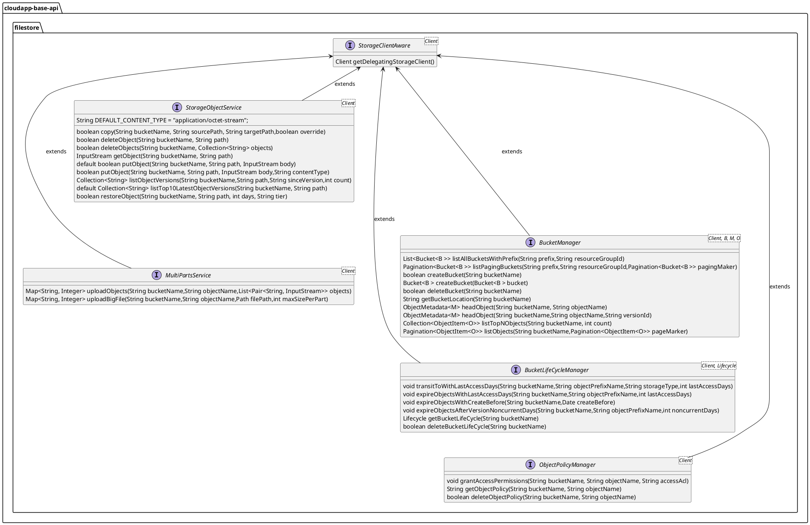

# 分布式对象存储设计与使用

# 设计说明

分布式对象存储是将任意类型和大小的数据通过对象形式存储，主要用于存储大规模非结构化数据。Framework在抽象层定义分布式对象存储操作统一抽象接口，并在实现层提供阿里云对象存储服务(OSS)、MinIO 的实现。

抽象层将主要接口分为两类，一类是以Service为后缀的接口，这类接口更多用于业务链路，它提供给开发者在业务处理中使用，支持上传文件、分段上传、删除对象等常用操作。另一类是以Manager为后缀的接口，这类接口更多用于管控链路，用于对象存储服务的管理而非业务处理，支持管理和配置存储桶等操作。

分布式对象存储服务中通用操作，在 Framework 中定义了相关接口方法，可以直接调用；各存储服务高阶或独特的用例，提供了代理接口，通过获取存储服务客户端进行调用。


分布式对象存储抽象设计如下：



1.  定义存储服务代理客户端接口 _**StorageClientAware**_ ，主要方法有：
    
    1.  _**getDelegatingStorageClient()**_ 获取当前使用的存储服务客户端对象；
        
2.  定义对象管理接口 _**StorageObjectService**_ ，主要方法有：
    
    1.  _**copy(String bucketName, String sourcePath, String targetPath,boolean override)**_ 创建已存在文件的副本；
        
    2.  _**deleteObject(String bucketName, String path)**_ 删除文件；
        
    3.  _**deleteObjects(String bucketName, Collection<String> objects)**_ 删除一组文件；
        
    4.  _**getObject(String bucketName, String path)**_ 获取文件；
        
    5.  _**putObject(String bucketName, String path, InputStream body)**_ 上传文件；
        
    6.  _**putObject(String bucketName, String path, InputStream body,String contentType)**_ 上传文件
        
    7.  _**listObjectVersions(String bucketName,String path,String sinceVersion,int count)**_ 获取存储桶中所有文件的版本信息；
        
    8.  _**listTop10LatestObjectVersions(String bucketName,String path)**_ 获取最新的 10 个文件版本；
        
    9.  _**restoreObject(String bucketName, String path, int days, String tier)**_ 恢复已归档的文件；
        
3.  定义分段上传操作接口 _**MultiPartsService**_ ，主要方法有：
    
    1.  _**uploadObjects(String bucketName,String objectName,List<Pair<String, InputStream>> objects)**_ 上传文件；
        
    2.  _**uploadBigFile(String bucketName,String objectName,Path filePath,int maxSizePerPart)**_ 上传大文件；
        
4.  定义存储桶管理接口 _**BucketManager**_ ，主要方法有：
    
    1.  _**listAllBucketsWithPrefix(String prefix, String resourceGroupId)**_ 按前缀获取存储桶列表;
        
    2.  _**listPagingBuckets(String prefix,String resourceGroupId,Pagination<Bucket<B >> pagingMaker)**_ 按前缀以分页形式获取存储桶列表;
        
    3.  _**createBucket(**__**String bucketName**__**)**_ 创建存储桶;
        
    4.  _**createBucket(Bucket<B > bucket)**_ 创建存储桶;
        
    5.  _**deleteBucket(String bucketName)**_ 删除存储桶;
        
    6.  _**getBucketLocation(String bucketName)**_ 获取存储桶的位置信息；
        
    7.  _**headObject(String bucketName, String objectName)**_ 获取文件元数据
        
    8.  _**headObject(String bucketName,String objectName,String versionId)**_ 获取指定版本文件元数据
        
    9.  _**listTopNObjects(String bucketName, int count)**_ 获取指定数量的文件；
        
    10.  _**listObjects(String bucketName,Pagination<ObjectItem<O>> pageMarker)**_ 分页形式获取文件列表；
        
5.  定义生命周期规则接口 _**BucketLifeCycleManager**_ ，主要方法有：
    
    1.  _**transitToWithLastAccessDays(String bucketName,String objectPrefixName,String storageType,int lastAccessDays)**_ 配置基于最后一次访问时间的转换存储类型生命周期规则；
        
    2.  _**expireObjectsWithLastAccessDays(String bucketName,String objectPrefixName,int lastAccessDays)**_ 配置基于最后一次访问时间的过期生命周期规则；
        
    3.  _**expireObjectsWithCreateBefore(String bucketName,**__**String objectPrefixName,**__**Date createBefore)**_ 配置最后一次修改时间早于指定时间的过期生命周期规则；
        
    4.  _**expireObjectsAfterVersionNoncurrentDays(String bucketName,String objectPrefixName,int noncurrentDays)**_ 在版本控制时，配置成为非当前版本在指定时间后的过期生命周期规则；
        
    5.  _**getBucketLifeCycle(String bucketName)**_ 获取存储桶的生命周期配置;
        
    6.  _**deleteBucketLifeCycle(String bucketName)**_ 删除存储桶的生命周期配置；
        
6.  定义权限策略接口 _**ObjectPolicyManager**_ ，主要方法有：  
    
    1.  _**grantAccessPermissions(String bucketName, String objectName, String accessAcl)**_ 配置权限策略；
        
    2.  _**getObjectPolicy(String bucketName, String objectName)**_ 获取权限策略
        
    3.  _**deleteObjectPolicy(String bucketName, String objectName)**_ 删除权限策略；
        

# 使用说明


## 配置说明

分布式对象存储实现的配置如下：

1.  定义 OSS 实现的配置参数类 _**OSSEndpointProperties**_ ，继承 _**EndpointProperties**_ ，使用注解 _**@ConfigurationProperties(prefix = AliyunFileStoreComponent.BINDING\_PROP\_KEY)**_ ，其中  _**AliyunFileStoreComponent.BINDING\_PROP\_KEY=com.alibaba.cloudapp.filestore.aliyun**_ ，配置参数类字段如下：
    

|  **字段名**  |  **数据类型**  |  **默认值**  |  **备注**  |
| --- | --- | --- | --- |
|  enabled  |  boolean  |  false  |  是否启用  |
|  accessKey  |  String  |  \-  |  AccessKey ID  |
|  secretKey  |  String  |  \-  |  AccessKey Secret  |
|  region  |  String  |  \-  |  区域  |
|  stsToken  |  String  |  \-  |  临时身份凭证  |
|  endpoint  |  String  |  \-  |  接入点  |

2.  定义 Minio 实现的配置参数类 _**MinioEndpointProperties**_ ，继承 _**EndpointProperties**_ ，使用注解 _**@ConfigurationProperties(prefix = com.alibaba.cloudapp.filestore.minio)**_ ，配置参数类字段如下：
    

|  **字段名**  |  **数据类型**  |  **默认值**  |  **备注**  |
| --- | --- | --- | --- |
|  enabled  |  boolean  |  false  |  是否启用  |
|  accessKey  |  String  |  \-  |  AccessKey ID  |
|  secretKey  |  String  |  \-  |  AccessKey Secret  |
|  region  |  String  |  \-  |  区域  |
|  stsToken  |  String  |  \-  |  临时身份凭证  |
|  endpoint  |  String  |  \-  |  接入点  |


## 场景一：使用 CloudApp 封装的客户端上传文件到 OSS

### POM配置

添加 CloudApp Starter 和 OSS 分布式对象存储的实现依赖。

```xml
<dependencyManagement>
    <dependencies>
        <dependency>
            <groupId>${cloudapp.groupId}</groupId>
            <artifactId>cloudapp-framework-dependencies</artifactId>
            <version>${cloudapp.version}</version>
            <type>pom</type>
            <scope>import</scope>
        </dependency>
    </dependencies>
</dependencyManagement>
<dependencies>
    <dependency>
        <groupId>org.springframework.boot</groupId>
        <artifactId>spring-boot-starter</artifactId>
    </dependency>
    <dependency>
        <groupId>${cloudapp.groupId}</groupId>
        <artifactId>spring-boot-starter-cloudapp</artifactId>
    </dependency>
    <dependency>
        <groupId>${cloudapp.groupId}</groupId>
        <artifactId>cloudapp-spring-filestore-aliyun</artifactId>
    </dependency>
</dependencies>
```

### 应用配置

在应用中配置 CloudApp 的属性，在环境变量中配置accessKey、secretKey，端点使用 OSS 深圳地区的访问地址；

```yaml
spring:
  application:
    name: filestore-aliyun-demo

io:
  cloudapp:
    filestore:
      aliyun:
        enabled: true
        accessKey: ${ACCESS_KEY}
        secretKey: ${SECRET_KEY}
        endpoint: oss-cn-shenzhen.aliyuncs.com
```

### 使用验证

通过抽象的存储文件服务上传文件，以上传 Windows 系统中 `C:\Users\cloudtogo\Desktop\test.txt` 文件为例，将文件上传到 OSS 的 gxrtestoss 存储桶中。

```java
public class BucketService {

    @Autowired
    private StorageObjectService storageObjectService;

    public void createObject() {
        try {
            FileInputStream inputStream = new FileInputStream("C:\Users\cloudtogo\Desktop\test.txt");
            storageObjectService.putObject("gxrtestoss", "test.txt", inputStream);
        } catch (FileNotFoundException e) {
            e.printStackTrace();
        } catch (CloudAppException e) {
            e.printStackTrace();
        }
    }

    @PostConstruct
    public void init() throws CloudAppException {
        createObject();
    }
}

```

## 场景二：使用扩展接口获取 OSS 文件标签信息

通过扩展接口获取委托类，然后再获取 OSS 文件标签信息。

### POM配置

添加 CloudApp Starter 和 OSS 分布式对象存储的实现依赖。

```xml
<dependencyManagement>
    <dependencies>
        <dependency>
            <groupId>${cloudapp.groupId}</groupId>
            <artifactId>cloudapp-framework-dependencies</artifactId>
            <version>${cloudapp.version}</version>
            <type>pom</type>
            <scope>import</scope>
        </dependency>
    </dependencies>
</dependencyManagement>
<dependencies>
    <dependency>
        <groupId>org.springframework.boot</groupId>
        <artifactId>spring-boot-starter</artifactId>
    </dependency>
    <dependency>
        <groupId>${cloudapp.groupId}</groupId>
        <artifactId>spring-boot-starter-cloudapp</artifactId>
    </dependency>
    <dependency>
        <groupId>${cloudapp.groupId}</groupId>
        <artifactId>cloudapp-spring-filestore-aliyun</artifactId>
    </dependency>
</dependencies>
```

### 应用配置

在应用中配置 CloudApp 的属性，在环境变量中配置accessKey、secretKey，端点使用 OSS 深圳地区的访问地址；

```yaml
spring:
  application:
    name: filestore-aliyun-demo

io:
  cloudapp:
    filestore:
      aliyun:
        enabled: true
        accessKey: ${ACCESS_KEY}
        secretKey: ${SECRET_KEY}
        endpoint: oss-cn-shenzhen.aliyuncs.com
```

### 使用验证

通过扩展接口获取 OSS 原生客户端委托类，然后用于获取文件标签信息，以获取存储桶 gxrtestoss 中文件 test.txt 的 tag 为例。

```java
public class BucketService {

    @Autowired
    private StorageObjectService storageObjectService;

    public void getObjectTagging() {
        OSSClient ossClient = (OSSClient) storageObjectService.getDelegatingStorageClient();
        TagSet tagSet =ossClient.getObjectTagging("gxrtestoss", "test.txt");
        System.out.println(tagSet.toString());
    }

    @PostConstruct
    public void init() throws CloudAppException {
        getObjectTagging();
    }

}

```

调用结果：


## 场景三：使用扩展接口获取 MinIO 文件标签信息

通过扩展接口获取委托类，然后再获取 OSS 文件标签信息。

### POM配置

添加 CloudApp Starter 和 MinIO 分布式对象存储的实现依赖，本例以 http 方式调用因此引入 web 依赖。

```xml
<dependencyManagement>
    <dependencies>
        <dependency>
            <groupId>${cloudapp.groupId}</groupId>
            <artifactId>cloudapp-framework-dependencies</artifactId>
            <version>${revision}</version>
            <type>pom</type>
            <scope>import</scope>
        </dependency>
    </dependencies>
</dependencyManagement>
<dependencies>
    <dependency>
        <groupId>org.springframework.boot</groupId>
        <artifactId>spring-boot-starter</artifactId>
    </dependency>
    <dependency>
        <groupId>${cloudapp.groupId}</groupId>
        <artifactId>spring-boot-starter-cloudapp</artifactId>
    </dependency>
    <dependency>
        <groupId>${cloudapp.groupId}</groupId>
        <artifactId>cloudapp-spring-filestore-minio</artifactId>
        <exclusions>
            <exclusion>
                <groupId>com.squareup.okhttp3</groupId>
                <artifactId>okhttp</artifactId>
            </exclusion>
        </exclusions>
    </dependency>
    <dependency>
        <groupId>com.squareup.okhttp3</groupId>
        <artifactId>okhttp</artifactId>
        <version>4.12.0</version>
    </dependency>
    <dependency>
        <groupId>org.springframework.boot</groupId>
        <artifactId>spring-boot-starter-web</artifactId>
    </dependency>
</dependencies>
```

### 应用配置

在应用中配置 CloudApp MinIO 实现的属性，在环境变量中配置访问凭证 AK、SK 和 MinIO 访问端点MINIO\_ENDPOINT；

```yaml
spring:
  application:
    name: demo-minio

io:
  cloudapp:
    filestore:
      minio:
        enabled: true
        endpoint: ${MINIO_ENDPOINT}
        accessKey: ${AK}
        secretKey: ${SK}

server:
  port: 8080
```

### 使用验证

通过扩展接口获取 MinIO 原生客户端委托类，然后用于获取文件标签信息，以获取存储桶test987中文件test.txt 的 tag 为例。

```java
@RestController
public class StorageObjectController {
    
    private static final Logger logger = org.slf4j.LoggerFactory.getLogger(
            StorageObjectController.class);
    
    @Autowired
    private StorageObjectService storageObjectService;
    
    @RequestMapping("getObjectTag")
    public void getObjectTag() {
        MinioClient client = (MinioClient) storageObjectService.getDelegatingStorageClient();
        GetObjectTagsArgs args = GetObjectTagsArgs.builder()
                                 .bucket("test987")
                                 .object("test.txt")
                                 .build();
        Tags tags = null;
        try {
            tags = client.getObjectTags(args);
        } catch (Exception e) {
            logger.error(e.getMessage(), e);
        }
        Map<String, String> map = tags.get();
        map.forEach((k, v) -> logger.info("{} : {}", k, v));
    }

}

```

调用结果：

