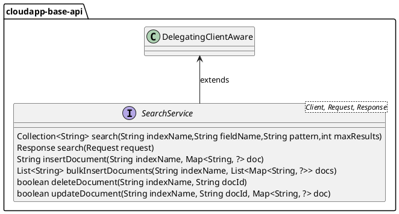

# 分布式搜索设计与使用


# 设计说明

分布式搜索参考 Elasticsearch 进行设计，在 Framework 中定义了常见搜索的常见操作，例如搜索、插入、批量插入、修改和删除等。在需要使用搜索高级用例的场景中，可以通过获取原生客户端委托实例方式来进行使用。


分布式搜索抽象设计如下：



1.  定义搜索服务接口 _**SearchService**_ ，继承接口 _**DelegatingClientAware**_ ，主要方法有：
    
    1.  _**getDelegatingClient()**_ 获取搜索客户端委托实例；
        
    2.  _**search(String indexName,String fieldName,String pattern,int maxResults)**_ 在指定索引字段通过模式搜索；
        
    3.  _**search(Request request)**_ 通过请求信息搜索；
        
    4.  _**insertDocument(String indexName, Map<String, ?> doc)**_ 在索引中创建文档；
        
    5.  _**bulkInsertDocuments(String indexName, List<Map<String, ?>> docs)**_ 批量插入文档；
        
    6.  _**deleteDocument(String indexName, String docId)**_ 删除文档；
        
    7.  _**updateDocument(String indexName, String docId, Map<String, ?> doc)**_ 更新文档；
        

# 使用说明

## 配置说明
分布式搜索实现的配置如下：

1.  定义分布式存储的配置参数类 _**ElasticsearchProperties**_ ，使用注解 _**@ConfigurationProperties(prefix = "io.cloudapp.search.elasticsearch")**_ ，配置参数类字段如下：
    

|  **字段名**  |  **数据类型**  |  **默认值**  |  **备注**  |
| --- | --- | --- | --- |
|  enabled  |  boolean  |  false  |  是否启用阿里云 elastisearch  |
|  host  |  String  |  \-  |  elasticsearch 连接地址  |
|  port  |  int  |  9200  |  端口  |
|  username  |  String  |  \-  |  用户名  |
|  password  |  String  |  \-  |  密码  |
|  useHttps  |  boolean  |  false  |  是否启用 https  |


## 场景一：通过 CloudApp 封装的客户端搜索文档

### POM 配置

```xml
<dependencyManagement>
    <dependencies>
        <dependency>
            <groupId>${groupId}</groupId>
            <artifactId>cloudapp-framework-dependencies</artifactId>
            <version>${cloudapp.version}</version>
            <type>pom</type>
            <scope>import</scope>
        </dependency>
    </dependencies>
</dependencyManagement>
<dependencies>
    <dependency>
        <groupId>org.springframework.boot</groupId>
        <artifactId>spring-boot-starter</artifactId>
    </dependency>
    <dependency>
        <groupId>${groupId}</groupId>
        <artifactId>spring-boot-starter-cloudapp</artifactId>
    </dependency>
    <dependency>
        <groupId>${groupId}</groupId>
        <artifactId>cloudapp-spring-search-elasticsearch</artifactId>
    </dependency>  
    <dependency>
        <groupId>org.springframework.boot</groupId>
        <artifactId>spring-boot-starter-web</artifactId>
    </dependency>
</dependencies>
```

### 应用配置

```yaml
spring:
  application:
    name: elasticsearch-demo

io:
  cloudapp:
    search:
      elasticsearch:
        enabled: true
        host: ${ES_HOST}
        username: ${ES_USERNAME}
        password: ${ES_PASSWORD}
```

### 使用验证

```java
@RestController
public class ElasticsearchDemoController {

    private static final Logger LOGGER = LoggerFactory.getLogger(ElasticsearchDemoController.class);

    @Autowired
    SearchService searchService;

    @RequestMapping("/testSearch")
    public void testSearch() {
        String indexName = "test-index";
        String fieldName = "title";
        String pattern = "EDAS";
        int maxResults = 10;
        Collection<String> result = searchService.search(indexName, fieldName, pattern, maxResults);
        LOGGER.info("search document result: {}", JSON.toJSONString(result));
    }
}
```