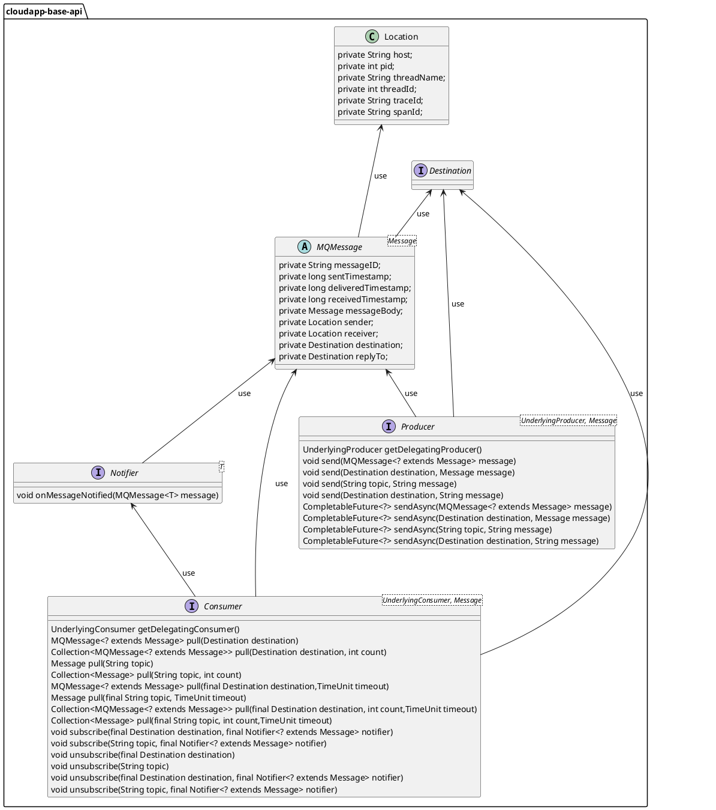

# 分布式消息设计与使用


# 设计说明

在 Framework 分布式消息抽象层，抽象了通信模型使用到的 3 个主要接口，分别是：消费者接口 Conusmer、生产者接口 Producer 和监听接口Notifier，接口按消息类型定义了字符串消息、MQ 原始消息、Framework 封装消息对应的消费/发送方法，用于满足 MQ 通用场景。

在需要使用到各 MQ 系统的消费者/生产者高阶用例场景中，如自定义消费逻辑、消费重试等，接口定义了获取底层的委托消费者/生产者对象方法，通过它调用对应 MQ 系统原生 SDK 来进行处理。

在使用 spring stream 的方式工作的场景中，可以通过配置 Framework 关闭 Framework 的消息驱动。关闭后Framework 的 messaging 机制将完全遵循原生的消息驱动的实现。


分布式消息抽象设计如下：



1.  定义消息消费者接口 _**Consumer**_ ，主要方法有：
    
    1.  _**getDelegatingConsumer()**_ 获取底层的委托消费者对象，通过它调用对应 MQ 系统原生 SDK 来处理更底层或高级的消费者逻辑；
        
    2.  _**pull(Destination destination)**_ 从 Destination 消费消息；
        
    3.  _**pull(Destination destination, int count)**_ 从Destination 消费一组消息；
        
    4.  _**pull(String topic)**_ 从 topic 中消费消息；
        
    5.  _**pull(String topic, int count)**_ 从 topic 中消费一组消息；
        
    6.  _**pull(final Destination destination,TimeUnit timeout)**_ 从Destination 消费消息，并设置超时；
        
    7.  _**pull(final String topic, TimeUnit timeout)**_ 从topic 消费消息，并设置超时；
        
    8.  _**pull(final Destination destination, int count,TimeUnit timeout)**_ 从Destination 消费一组消息，并设置超时；
        
    9.  _**pull(final String topic, int count,TimeUnit timeout)**_ 从 topic 消费一组消息，并设置超时
        
    10.  _**subscribe(final Destination destination, final Notifier<? extends Message> notifier)**_ 从Destination订阅消息主题，并设置监听；
        
    11.  _**subscribe(String topic, final Notifier<? extends Message> notifier)**_ 从 topic 订阅消息主题，并设置监听；
        
    12.  _**unsubscribe(final Destination destination)**_ 从Destination 取消订阅；
        
    13.  _**unsubscribe(final Destination destination, final Notifier<? extends Message> notifier)**_ 从Destination 取消订阅，并设置监听；
        
    14.  _**unsubscribe(String topic)**_ 从 topic 取消订阅
        
    15.  _**unsubscribe(String topic, final Notifier<? extends Message> notifier)**_ 从 topic 取消订阅并设置监听；
        
2.  定义消息生产者接口 _**Producer**_ ，主要方法有：
    
    1.  _**getDelegatingProducer()**_ 获取底层的委托生产者对象，通过它调用对应 MQ 系统原生 SDK 来处理更底层或高级的生产者逻辑；
        
    2.  _**send(MQMessage<? extends Message> message)**_ 发送MQMessage封装消息；
        
    3.  _**send(Destination destination, Message message)**_ 向Destination发送Message 原始消息；
        
    4.  _**send(String topic, String message)**_ 向topic 发送字符串消息；
        
    5.  _**send(Destination destination, String message)**_ 向Destination 发送字符串消息；
        
    6.  _**sendAsync(MQMessage<? extends Message> message)**_ 异步发送MQMessage封装消息；
        
    7.  _**sendAsync(Destination destination, Message message)**_ 异步向Destination发送Message 原始消息；
        
    8.  _**sendAsync(String topic, String message)**_ 异步向topic 发送字符串消息；
        
    9.  _**sendAsync(Destination destination, String message)**_ 异步向Destination 发送字符串消息；
        
3.  定义监听接口 _**Notifier**_ ，主要方法有：onMessageNotified(MQMessage<T> message)当监听事件触发时进行处理；
    
4.  定义接口 _**Destination**_ ，用于设置消息目标；
    
5.  定义类 _**Location**_ ，用于设置消息发送或接受位置，包括主机、进程 id、线程名、线程 id 等；
    
6.  定义抽象类 _**MQMessage**_ ，用于封装消息；
    

# 使用说明

## 配置说明
分布式消息实现的配置如下：


1.  定义 Kafka 实现的配置参数类 _**CloudAppKafkaProperties**_ ，使用注解 _**@ConfigurationProperties("com.alibaba.cloudapp.messaging.kafka")**_ ，配置参数类字段如下：
        

|  **字段名**  |  **数据类型**  |  **默认值**  | **备注 true**                              |
| --- | --- | --- |------------------------------------------|
|  enabled  |  boolean  |  true  | 是否启用                                     |
|  servers  |  String  |  \-  | 服务器地址                                    |
|  ssl  |  _**org.springframework.boot.autoconfigure.kafka.KafkaProperties.Ssl**_  |  new KafkaProperties.Ssl()  | SSL 设置                                   |
|  username  |  String  |  \-  | 用户名                                      |
|  password  |  String  |  \-  | 密码                                       |
|  mechanism  |  String  |  \-  | 客户端连接的身份验证机制，非必填，示例值：PLAIN、SCRAM-SHA-256 |
|  securityProtocol  |  String  |  \-  | 通信的协议，非必填，示例值：SASL\_SSL、SASL\_PLAINTEXT  |
|  identificationAlgorithm  |  String  |  \-  | 使用服务器证书验证服务器主机名的识别算法                     |
|  inputs  |  List<_**KafkaConsumerProperties**_\>  |  \-  | kafka 消费者列表                              |
|  outputs  |  List<_**KafkaProducerProperties**_\>  |  \-  | kafka 生产者列表                              |
    
> kafka客户端需要的SSL证书(trust-store-location)默认存放在kafka服务端 `/home/admin/kafka-pkgs/kafka.client.truststore.jks` 路径中。
    
  定义 Kafka 消费者参数类 _**KafkaConsumerProperties**_ ，字段如下：
    

|  **字段名**  |  **数据类型**  |  **默认值**  |  **备注**  |
| --- | --- | --- | --- |
|  group  |  String  |  \-  |  消费者分组  |
|  name  |  String  |  \-  |  名称  |
|  topic  |  String  |  \-  |  消息主题  |
|  bootstrapServers  |  String  |  \-  |  Kafka 集群访问地址，格式为：host:port[,host2:port][,host3:port]  |
|  autoOffsetReset  |  String  |  \-  |  当 Kafka 中没有初始偏移量或服务器上当前偏移量不再存在时的处理方式  |
|  maxFetchBytes  |  int  |  \-  |  服务器给获取请求返回的最大数据量  |
|  sessionTimeout  |  int  |  \-  |  Kafka 的组管理工具时用于检测客户端故障的超时时间，单位：毫秒  |
|  keyDeserializer  |  Class  |  StringDeserializer.class  |  值的反序列化类  |
|  valueDeserializer  |  Class  |  StringDeserializer.class  |  键 的反序列化类  |
|  isolationLevel  |  Byte  |  0  |  读取已事务性写入的消息的隔离级别，可选值有： IsolationLevel.READ\_UNCOMMITTED（0）、IsolationLevel.READ\_COMMITTED（1）  |
|  properties  |  Map<String, Object>  |  \-  |  用于配置客户端的附加消费者特定属性  |

  定义 Kafka 生产者参数类 _**KafkaProducerProperties**_ ，字段如下：
    

|  **字段名**  |  **数据类型**  |  **默认值**  |  **备注**  |
| --- | --- | --- | --- |
|  group  |  String  |  \-  |  分组  |
|  name  |  String  |  \-  |  名称  |
|  topic  |  String  |  \-  |  消息主题  |
|  partition  |  int  |  \-  |  分区  |
|  bootstrapServers  |  String  |  \-  |  Kafka 集群访问地址，格式为：host:port[,host2:port][,host3:port]  |
|  reconnectBackoff  |  int  |  3000  |  设置客户端在尝试重新连接到 Broker 之前的等待时间，单位毫秒  |

2.  定义 RocketMQ 实现的配置参数类 _**CloudAppRocketProperties**_ ，使用注解 _**@ConfigurationProperties(prefix = "com.alibaba.cloudapp.messaging.rocketmq",ignoreUnknownFields = false,ignoreInvalidFields = true)**_ ，配置参数类字段如下：
        

|  **字段名**  |  **数据类型**  |  **默认值**  |  **备注**  |
| --- | --- | --- | --- |
|  enabled  |  boolean  |  \-  |  是否启用  |
|  nameServer  |  String  |  \-  |  Name Server 的地址  |
|  username  |  String  |  \-  |  用户名  |
|  password  |  String  |  \-  |  密码  |
|  useTLS  |  boolean  |  \-  |  启用 TLS  |
|  enableMsgTrace  |  boolean  |  \-  |  启用消息追踪  |
|  traceTopic  |  String  |  \-  |  消息追踪主题，消息追踪数据将存储在此主题中  |
|  accessChannel  |  String  |  LOCAL  |  访问通道，可选值：CLOUD、LOCAL  |
|  inputs  |  List<_**RocketConsumerProperties**_\>  |  \-  |  消费者列表  |
|  outputs  |  List<_**RocketProducerProperties**_\>  |  \-  |  生产者列表  |

  定义 RocketMQ 消费者参数类 _**RocketConsumerProperties**_ ，字段如下：
    

|  **字段名**  |  **数据类型**  |  **默认值**  |  **备注**  |
| --- | --- | --- | --- |
|  accessChannel  |  String  |  \-  |  访问通道，可选值：CLOUD、LOCAL  |
|  group  |  String  |  \-  |  消费者分组  |
|  messageModel  |  _**MessageModel**_  |  MessageModel.CLUSTERING  |  消息模型，可选值：BROADCASTING(广播模式)、CLUSTERING(集群模式)  |
|  pullBatchSize  |  int  |  10  |  消费者在一次拉取操作中从消息队列请求的消息数量上限  |
|  namespace  |  String  |  \-  |  \-  |
|  name  |  String  |  \-  |  名称  |
|  topic  |  String  |  \-  |  主题  |
|  tags  |  List<String>  |  \-  |  标签列表  |
|  nameServer  |  String  |  \-  |  Name Server 的地址  |
|  username  |  String  |  \-  |  用户名  |
|  password  |  String  |  \-  |  密码  |
|  useTLS  |  boolean  |  false  |  启用 TLS  |
|  enableMsgTrace  |  boolean  |  \-  |  启用消息追踪  |
|  traceTopic  |  String  |  \-  |  消息追踪主题，消息追踪数据将存储在此主题中  |
|  type  |  String  |  \-  |  消费类型，可选值：PUSH、PULL  |
|  isDefault  |  boolean  |  false  |  是否为默认消费者。在应用配置文件中可配置多个消费者，其中默认消费者将作为自动注入 RocketMQTemplate 的配置  |

  定义 RocketMQ 生产者参数类 _**RocketProducerProperties**_ ，字段如下：
    

|  **字段名**  |  **数据类型**  |  **默认值**  |  **备注**  |
| --- | --- | --- | --- |
|  group  |  String  |  \-  |  生产者分组  |
|  name  |  String  |  \-  |  名称  |
|  namespace  |  String  |  \-  |  \-  |
|  sendTimeout  |  int  |  3000  |  消息发送超时时间，单位超时  |
|  retryNextServer  |  boolean  |  false  |  消息发送失败时是否重新发送到另一个 Broker  |
|  compressMsgBodyOverHowMuch  |  int  |  1024 \* 4  |  消息体进行压缩的阈值，单位 Byte  |
|  maxMessageSize  |  int  |  1024 \* 1024 \* 4  |  消息的最大大小，单位 Byte  |
|  retryTimesWhenSendFailed  |  int  |  2  |  消息发送失败时，重试次数  |
|  nameServer  |  String  |  \-  |  Name Server 的地址  |
|  username  |  String  |  \-  |  用户名  |
|  password  |  String  |  \-  |  密码  |
|  useTLS  |  boolean  |  false  |  启用 TLS  |
|  enableMsgTrace  |  boolean  |  \-  |  启用消息追踪  |
|  traceTopic  |  String  |  \-  |  消息追踪主题，消息追踪数据将存储在此主题中  |
|  isDefault  |  boolean  |  false  |  是否为默认生产者。在应用配置文件中可配置多个生产者，其中默认生产者将作为自动注入 RocketMQTemplate 的配置  |


使用场景按 MQ 系统分为两大类：RocketMQ 和 Kafka。

## RocketMQ 使用场景

### 使用 CloudApp 封装的 RocketMQ 驱动进行简单的消息收发

#### 配置POM依赖

```xml
    <dependencyManagement>
        <dependencies>
            <dependency>
                <groupId>${cloudapp.groupId}</groupId>
                <artifactId>cloudapp-framework-dependencies</artifactId>
                <version>1.0.0</version>
                <scope>import</scope>
                <type>pom</type>
            </dependency>
        </dependencies>
    </dependencyManagement>

    <dependencies>

        <dependency>
            <groupId>org.springframework.boot</groupId>
            <artifactId>spring-boot-starter</artifactId>
        </dependency>

        <dependency>
            <groupId>${cloudapp.groupId}</groupId>
            <artifactId>spring-boot-starter-cloudapp</artifactId>
        </dependency>

        <dependency>
            <groupId>org.springframework.boot</groupId>
            <artifactId>spring-boot-starter-web</artifactId>
        </dependency>

        <dependency>
            <groupId>${cloudapp.groupId}</groupId>
            <artifactId>cloudapp-spring-messaging-rocketmq</artifactId>
        </dependency>

    </dependencies>
```

#### 应用配置

```yaml
spring:
  application:
    name: ConsumerDemo

io:
  cloudapp:
    messaging:
      rocketmq:
        enabled: true
        nameServer: ${ROCKET_HOST}
        username: ${ROCKET_USERNAME}
        password: ${ROCKET_PASSWORD}
        inputs:
          - group: test-group
            name: rocketConsumer
            topic: test-topic
        outputs:
          - name: rocketProducer
            group: test-group

server:
  port: 8099
```

#### 使用验证

```java
@RestController
public class RocketConsumerDemoController {

    private static final Logger LOGGER = LoggerFactory.getLogger(RocketConsumerDemoController.class);

    @Autowired
    @Qualifier("rocketConsumer")
    @Lazy
    CloudAppRocketConsumer cloudAppRocketConsumer;

    @Autowired
    @Qualifier("rocketProducer")
    @Lazy
    CloudAppRocketProducer cloudAppRocketProducer;

    @RequestMapping("/testRocketConsumer")
    public void testRocketConsumer() {
        MessageExt message = cloudAppRocketConsumer.pull("test-topic");
        LOGGER.info(message.toString());
    }

    @RequestMapping("/testRocketProducer")
    public void testRocketProducer() {
        try {
            cloudAppRocketProducer.send("test-topic", "hello world!"    );
            LOGGER.info("send message success!");
        } catch (CloudAppException e) {
            LOGGER.error("send message failed!", e);
              e.printStackTrace();
        }
    }

}
```

### 使用原生的 RocketMQ 驱动进行消息发送与消费

#### 配置 POM 依赖

```xml
    <dependencyManagement>
        <dependencies>
            <dependency>
                <groupId>${cloudapp.groupId}</groupId>
                <artifactId>cloudapp-framework-dependencies</artifactId>
                <version>1.0.0</version>
                <scope>import</scope>
                <type>pom</type>
            </dependency>
        </dependencies>
    </dependencyManagement>

    <dependencies>

        <dependency>
            <groupId>org.springframework.boot</groupId>
            <artifactId>spring-boot-starter</artifactId>
        </dependency>

        <dependency>
            <groupId>${cloudapp.groupId}</groupId>
            <artifactId>spring-boot-starter-cloudapp</artifactId>
        </dependency>

        <dependency>
            <groupId>org.springframework.boot</groupId>
            <artifactId>spring-boot-starter-web</artifactId>
        </dependency>

        <dependency>
            <groupId>${cloudapp.groupId}</groupId>
            <artifactId>cloudapp-spring-messaging-rocketmq</artifactId>
        </dependency>

    </dependencies>
```

####  应用配置

```yaml
spring:
  application:
    name: ConsumerDemo

io:
  cloudapp:
    messaging:
      rocketmq:
        enabled: true
        nameServer: ${ROCKET_HOST}
        username: ${ROCKET_USERNAME}
        password: ${ROCKET_PASSWORD}
        inputs:
          - group: test-group
            name: rocketConsumer
            topic: test-topic
        outputs:
          - name: rocketProducer
            group: test-group

server:
  port: 8099
```

#### 使用验证

```java
 @RestController
 public class RocketConsumerDemoController {
 
     private static final Logger LOGGER = LoggerFactory.getLogger(RocketConsumerDemoController.class);
 
     @Autowired
     @Qualifier("rocketConsumer")
     @Lazy
     CloudAppRocketConsumer cloudAppRocketConsumer;
 
     @Autowired
     @Qualifier("rocketProducer")
     @Lazy
     CloudAppRocketProducer cloudAppRocketProducer;
 
     @RequestMapping("/testDelegationRocketConsumer")
     public void testDelegationRocketConsumer() {
         List<MessageExt> messages = cloudAppRocketConsumer.getDelegatingConsumer().poll(1000);
         LOGGER.info(messages.toString());
     }
 
     @RequestMapping("/testDelegationRocketProducer")
     public void testDelegationRocketProducer() {
         Message message = new Message("test-topic", new byte[1024]);
         SendResult result = null;
         try {
             result = cloudAppRocketProducer.getDelegatingProducer().send(message);
         } catch (MQClientException e) {
             e.printStackTrace();
         } catch (RemotingException e) {
             e.printStackTrace();
         } catch (MQBrokerException e) {
             e.printStackTrace();
         } catch (InterruptedException e) {
             e.printStackTrace();
         }
         LOGGER.info(result.toString());
     }
 
 }
```

### 以 Spring Cloud Stream 的方式，消费 RocketMQ 消息

#### 配置 POM 依赖

```xml
<dependencyManagement>
    <dependencies>
        <dependency>
            <groupId>${cloudapp.groupId}</groupId>
            <artifactId>cloudapp-framework-dependencies</artifactId>
            <version>${cloudapp.version}</version>
            <type>pom</type>
            <scope>import</scope>
        </dependency>
    </dependencies>
</dependencyManagement>
<dependencies>
    <dependency>
        <groupId>org.springframework.boot</groupId>
        <artifactId>spring-boot-starter</artifactId>
    </dependency>
    <dependency>
        <groupId>${cloudapp.groupId}</groupId>
        <artifactId>spring-boot-starter-cloudapp</artifactId>
    </dependency>
    <dependency>
        <groupId>${cloudapp.groupId}</groupId>
        <artifactId>cloudapp-spring-messaging-rocketmq-streaming</artifactId>
    </dependency>
</dependencies>
```

####  应用配置

```yaml
io:
  cloudapp:
    messaging:
      rocketmq:
        enabled: false # 与 spring stream 的方式工作时，关闭 cloudapp 的驱动

```

当我们需要与 spring stream 的方式工作时，在以上的配置中，将关闭 cloudapp 的消息驱动。此时将 cloudapp 的 messaging 机制将完全遵循原生的消息驱动的实现。关于 RocketMQ 的 streaming 使用方式，请参考：[https://github.com/alibaba/spring-cloud-alibaba/wiki/RocketMQ](https://github.com/alibaba/spring-cloud-alibaba/wiki/RocketMQ)

## Kafka 使用场景

### 使用 CloudApp 封装的 Kafka 驱动进行简单的消息收发

#### 配置POM依赖

```xml
<dependencyManagement>
    <dependencies>
        <dependency>
            <groupId>${cloudapp.groupId}</groupId>
            <artifactId>cloudapp-framework-dependencies</artifactId>
            <version>${cloudapp.version}</version>
            <type>pom</type>
            <scope>import</scope>
        </dependency>
    </dependencies>
</dependencyManagement>

<dependencies>
  
    <dependency>
        <groupId>org.springframework.boot</groupId>
        <artifactId>spring-boot-starter</artifactId>
    </dependency>
  
    <dependency>
        <groupId>${cloudapp.groupId}</groupId>
        <artifactId>spring-boot-starter-cloudapp</artifactId>
    </dependency>
  
    <dependency>
        <groupId>${cloudapp.groupId}</groupId>
        <artifactId>cloudapp-spring-messaging-kafka</artifactId>
    </dependency>
  
    <dependency>
        <groupId>org.springframework.boot</groupId>
        <artifactId>spring-boot-starter-web</artifactId>
    </dependency>
  
</dependencies>
```

#### 应用配置

```yaml
spring:
  application:
    name: KafkaDemo

io:
  cloudapp:
    messaging:
      kafka:
        servers: ${KAFKA_SERVER}
        username: ${KAFKA_USERNAME}
        password: ${KAFKA_PASSWORD}
        mechanism: PLAIN
        security-protocol: SASL_SSL
        ssl:
          trust-store-location: classpath:/sasl/mix.4096.client.truststore.jks
        inputs:
          - name: testKafkaConsumer
            topic: test-topic
            group: test-group
        outputs:
          - name: testKafkaProducer
            group: test-group
            topic: test-topic

server:
  port: 8099
```

[《mix.4096.client.truststore.jks》](assets/mix.4096.client.truststore.jks)

#### 使用验证

```java
@RestController
public class KafkaDemoController {

    @Autowired
    @Qualifier("testKafkaConsumerConfig")
    KafkaConsumerProperties kafkaConsumerProperties;

    @Autowired
    @Qualifier("testKafkaProducer")
    CloudAppKafkaProducer cloudAppKafkaProducer;

    @RequestMapping("/testCloudAppKafkaConsumer")
    public void testKafkaProducerProperties() {
        kafkaConsumerProperties.setName("test-consumer" + RandomStringGenerator.generate(3));
        CloudAppKafkaConsumer consumer = new CloudAppKafkaConsumer(kafkaConsumerProperties);
        consumer.poll(1000);
    }

    @RequestMapping("/testCloudAppKafkaProducer")
    public void testCloudAppKafkaProducer() {
        cloudAppKafkaProducer.send("test-topic", "hello world!");
    }

}
```

### 使用原生的 Kafka 驱动进行消息发送与消费

#### 配置 POM 依赖

```shell
<dependencyManagement>
    <dependencies>
        <dependency>
            <groupId>${cloudapp.groupId}</groupId>
            <artifactId>cloudapp-framework-dependencies</artifactId>
            <version>${cloudapp.version}</version>
            <type>pom</type>
            <scope>import</scope>
        </dependency>
    </dependencies>
</dependencyManagement>

<dependencies>
  
    <dependency>
        <groupId>org.springframework.boot</groupId>
        <artifactId>spring-boot-starter</artifactId>
    </dependency>
  
    <dependency>
        <groupId>${cloudapp.groupId}</groupId>
        <artifactId>spring-boot-starter-cloudapp</artifactId>
    </dependency>
  
    <dependency>
        <groupId>${cloudapp.groupId}</groupId>
        <artifactId>cloudapp-spring-messaging-kafka</artifactId>
    </dependency>
  
    <dependency>
        <groupId>org.springframework.boot</groupId>
        <artifactId>spring-boot-starter-web</artifactId>
    </dependency>
  
</dependencies>
```

####  应用配置

```yaml
spring:
  application:
    name: KafkaDemo

io:
  cloudapp:
    messaging:
      kafka:
        servers: ${KAFKA_SERVER}
        username: ${KAFKA_USERNAME}
        password: ${KAFKA_PASSWORD}
        mechanism: PLAIN
        security-protocol: SASL_SSL
        ssl:
          trust-store-location: classpath:/sasl/mix.4096.client.truststore.jks
        inputs:
          - name: testKafkaConsumer
            topic: test-topic
            group: test-group
        outputs:
          - name: testKafkaProducer
            group: test-group
            topic: test-topic

server:
  port: 8099
```

[《mix.4096.client.truststore.jks》](assets/mix.4096.client.truststore.jks)

#### 使用验证

```java
@RestController
public class KafkaDemoController {

    @Autowired
    @Qualifier("testKafkaConsumerConfig")
    KafkaConsumerProperties kafkaConsumerProperties;

    @Autowired
    @Qualifier("testKafkaProducer")
    CloudAppKafkaProducer cloudAppKafkaProducer;

    @RequestMapping("/testDelegatingKafkaConsumer")
    public void testDelegatingKafkaConsumer() {
        kafkaConsumerProperties.setName("test-consumer");
        CloudAppKafkaConsumer consumer = new CloudAppKafkaConsumer(kafkaConsumerProperties);
        consumer.getDelegatingConsumer().poll(1000);
    }

    @RequestMapping("/testDelegateKafkaProducer")
    public void testDelegateKafkaProducer() {
        ProducerRecord<String, String> record = new ProducerRecord<>("test-topic", "messageKey", "hello world!");
        cloudAppKafkaProducer.getDelegatingProducer().send(record);
    }

}
```

### 以 Spring Cloud Stream 的方式，发送消费 Kafka 消息

#### 配置 POM 依赖

```xml
<dependencyManagement>
    <dependencies>
        <dependency>
            <groupId>${cloudapp.groupId}</groupId>
            <artifactId>cloudapp-framework-dependencies</artifactId>
            <version>${cloudapp.version}</version>
            <type>pom</type>
            <scope>import</scope>
        </dependency>
    </dependencies>
</dependencyManagement>
<dependencies>
    <dependency>
        <groupId>org.springframework.boot</groupId>
        <artifactId>spring-boot-starter</artifactId>
    </dependency>
    <dependency>
        <groupId>${cloudapp.groupId}</groupId>
        <artifactId>spring-boot-starter-cloudapp</artifactId>
    </dependency>
    <dependency>
        <groupId>${cloudapp.groupId}</groupId>
        <artifactId>cloudapp-spring-messaging-kafka-streaming</artifactId>
    </dependency>
</dependencies>
```

####  应用配置

```yaml
io:
  cloudapp:
    messaging:
      kafka:
        enabled: false # 与 spring stream 的方式工作时，关闭 cloudapp 的驱动

```

当我们需要与 spring stream 的方式工作时，在以上的配置中，将关闭 cloudapp 的消息驱动。此时将 cloudapp 的 messaging 机制将完全遵循原生的消息驱动的实现。关于 Kafka 的 streaming 使用方式，请参考：[https://github.com/alibaba/spring-cloud-alibaba/wiki/RocketMQ](https://github.com/alibaba/spring-cloud-alibaba/wiki/RocketMQ)