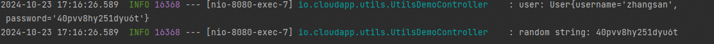

# 工具类设计与使用

# 设计说明

框架包含的工具类可以分为两类，一类是框架全局可用的基础工具类；另一类是主要用于特定云产品实现的工具类。

业务开发者主要使用框架提供的基础工具类，这些类统一存放在cloudapp-base-utils 模块中，包括：日期时间类、字符串处理类等等。

# 使用说明


## 场景一：使用字符串生成器生成随机密码

### POM配置

在 pom 中引入通用工具依赖 cloudapp-base-utils 模块。

```xml
<?xml version="1.0" encoding="UTF-8"?>
<project xmlns:xsi="http://www.w3.org/2001/XMLSchema-instance"
         xmlns="http://maven.apache.org/POM/4.0.0"
         xsi:schemaLocation="http://maven.apache.org/POM/4.0.0 http://maven.apache.org/xsd/maven-4.0.0.xsd">
    <modelVersion>4.0.0</modelVersion>

    <parent>
        <groupId>com.alibaba.cloudapp</groupId>
        <artifactId>cloudapp-framework-demos</artifactId>
        <version>${revision}</version>
        <relativePath>../pom.xml</relativePath>
    </parent>

    <groupId>com.alibaba.cloudapp</groupId>
    <artifactId>cloudapp-base-utils-demo</artifactId>
    <name>cloudapp-base-utils-demo</name>
    <packaging>jar</packaging>

    <dependencyManagement>
        <dependencies>
            <dependency>
                <groupId>com.alibaba.cloudapp</groupId>
                <artifactId>cloudapp-framework-dependencies</artifactId>
                <version>${revision}</version>
                <type>pom</type>
                <scope>import</scope>
            </dependency>
        </dependencies>
    </dependencyManagement>

    <dependencies>

        <dependency>
            <groupId>org.springframework.boot</groupId>
            <artifactId>spring-boot-starter</artifactId>
        </dependency>

        <dependency>
            <groupId>com.alibaba.cloudapp</groupId>
            <artifactId>cloudapp-base-utils</artifactId>
        </dependency>

        <dependency>
            <groupId>org.springframework.boot</groupId>
            <artifactId>spring-boot-starter-web</artifactId>
        </dependency>

    </dependencies>

</project>
```

### 应用配置

```yaml
spring:
  application:
    name: UtilsDemo

server:
  port: 8080
```

### 使用验证

以添加用户，使用随机字符串生成器给添加的用户生成 16 个字符长度的随机密码为例。

```java
@RestController
public class UtilsDemoController {
    
    private static final Logger logger =
            LoggerFactory.getLogger(UtilsDemoController.class);
    
    @RequestMapping("/randomPassword")
    public String randomPassword(String username) {
        String randomPassword = RandomStringGenerator.generate(16);
        
        User user = new User();
        user.setUsername(username);
        user.setPassword(randomPassword);
        
        logger.info("user: {}", user.toString());
        logger.info("random string: {}", randomPassword);
        
        return randomPassword;
    }
    
    class User {
        private String username;
        private String password;
        
        public String getUsername() {
            return username;
        }
        
        public void setUsername(String username) {
            this.username = username;
        }
        
        public String getPassword() {
            return password;
        }
        
        public void setPassword(String password) {
            this.password = password;
        }
        
        @Override
        public String toString() {
            return "User{" +
                    "username='" + username + '\'' +
                    ", password='" + password + '\'' +
                    '}';
        }
        
    }
    
}
```

