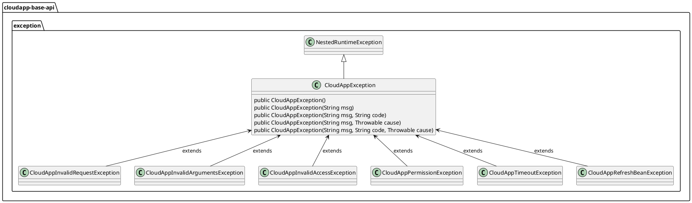

# 异常设计与使用

# 设计说明

在 Framework 中，定义了框架异常父类 CloudAppException，框架还定义了 CloudAppInvalidRequestException 无效请求类，即服务器端未正确处理请求如：参数无效、提交重复任务等。请求权限异常类 CloudAppPermissionException ，即请求权限错误如访问未授权资源。请求超时异常类 CloudAppTimeoutException，即客户端通过套接字通道读取或发送超时如：套接字超时或将大文件上传到服务器超时。无效访问异常类 CloudAppInvalidAccessException，无效访问包括一是客户端连接错误：socket连接，TLS 错误；二是凭证错误：aksk不正确、签名不匹配等；三是服务器错误：404、503 响应码。


异常抽象设计如下：



1.  定义了框架异常父类CloudAppException；
    
2.  定义了无效访问异常类CloudAppInvalidAccessException；
    
3.  定义了请求访问无效类CloudAppInvalidRequestException；
    
4.  定义了无效参数异常类CloudAppInvalidArgumentsException；
    
5.  定了请求权限异常类CloudAppPermissionException；
    
6.  定义了请求超时异常类CloudAppTimeoutException；
    
7.  定义了动态刷新异常类CloudAppRefreshBeanException；
    

# 使用说明

## 场景一：非法域名请求无效异常

### POM 配置

```xml
<dependencyManagement>
    <dependencies>
        <dependency>
            <groupId>${cloudapp.groupId}</groupId>
            <artifactId>cloudapp-framework-dependencies</artifactId>
            <version>${cloudapp.version}</version>
            <type>pom</type>
            <scope>import</scope>
        </dependency>
    </dependencies>
</dependencyManagement>
<dependencies>
    <dependency>
        <groupId>org.springframework.boot</groupId>
        <artifactId>spring-boot-starter</artifactId>
    </dependency>
    <dependency>
        <groupId>${cloudapp.groupId}</groupId>
        <artifactId>cloudapp-base-api</artifactId>
    </dependency>
</dependencies>
```

### 应用配置

无。

### 使用验证

```java
@RestController
public class OssController {

    @PostMapping("/upload")
    public ResponseEntity<String> upload() {
        String bucketName = "gxrtestoss";
        String objectName = "test-dir/test3.txt";
        String filePath= "C:\Users\cloudtogo\Desktop\test3.txt";
        Config config = new Config().setEndpoint(System.getenv("endpoint"))
                .setAccessKeyId(System.getenv("ALIBABA_CLOUD_ACCESS_KEY_ID"))
                .setAccessKeySecret(System.getenv("ALIBABA_CLOUD_ACCESS_KEY_SECRET"));
        PutObjectResponse response = new PutObjectResponse();
        try {
            Client client = new Client(config);
            response = client.putObject(bucketName, objectName, new PutObjectRequest().setBody(new FileInputStream(filePath)));
        } catch (CloudAppInvalidAccessException e) {
            e.printStackTrace();
        } catch (Exception e) {
            e.printStackTrace();
        }
        return  new ResponseEntity(HttpStatusCode.valueOf(response.getStatusCode()));
    }
}
```

## 场景二：权限不足，获取文件请求权限异常

### POM 配置

```xml
<dependencyManagement>
    <dependencies>
        <dependency>
            <groupId>${cloudapp.groupId}</groupId>
            <artifactId>cloudapp-framework-dependencies</artifactId>
            <version>${cloudapp.version}</version>
            <type>pom</type>
            <scope>import</scope>
        </dependency>
    </dependencies>
</dependencyManagement>
<dependencies>
    <dependency>
        <groupId>org.springframework.boot</groupId>
        <artifactId>spring-boot-starter</artifactId>
    </dependency>
    <dependency>
        <groupId>${cloudapp.groupId}</groupId>
        <artifactId>cloudapp-base-api</artifactId>
    </dependency>
</dependencies>
```

### 应用配置

无。

### 使用验证

```java
@RestController
public class OssController {

    @PostMapping("/upload")
    public ResponseEntity<String> upload() {
        String bucketName = "gxrtestoss";
        String objectName = "test-dir/test3.txt";
        String filePath= "C:\Users\cloudtogo\Desktop\test3.txt";
        Config config = new Config().setEndpoint(System.getenv("endpoint"))
                .setAccessKeyId(System.getenv("ALIBABA_CLOUD_ACCESS_KEY_ID"))
                .setAccessKeySecret(System.getenv("ALIBABA_CLOUD_ACCESS_KEY_SECRET"));
        PutObjectResponse response = new PutObjectResponse();
        try {
            Client client = new Client(config);
            response = client.putObject(bucketName, objectName, new PutObjectRequest().setBody(new FileInputStream(filePath)));
        } catch (CloudAppPermissionException e) {
            e.printStackTrace();
        } catch (Exception e) {
            e.printStackTrace();
        }
        return  new ResponseEntity(HttpStatusCode.valueOf(response.getStatusCode()));
    }
}
```

## 场景三：文件太大，上文件请求超时异常

### POM 配置

```xml
<dependencyManagement>
    <dependencies>
        <dependency>
            <groupId>${cloudapp.groupId}</groupId>
            <artifactId>cloudapp-framework-dependencies</artifactId>
            <version>${cloudapp.version}</version>
            <type>pom</type>
            <scope>import</scope>
        </dependency>
    </dependencies>
</dependencyManagement>
<dependencies>
    <dependency>
        <groupId>org.springframework.boot</groupId>
        <artifactId>spring-boot-starter</artifactId>
    </dependency>
    <dependency>
        <groupId>${cloudapp.groupId}</groupId>
        <artifactId>cloudapp-base-api</artifactId>
    </dependency>
</dependencies>
```

### 应用配置

无。

### 使用验证

```java
@RestController
public class OssController {

    @PostMapping("/upload")
    public ResponseEntity<String> upload() {
        String endpoint = "oss-cn-shenzhen.aliyuncs.com";
        String bucketName = "gxrtestoss";
        String objectName = "test-dir/test3.txt";
        String filePath= "C:\Users\cloudtogo\Desktop\test3.txt";
        Config config = new Config().setEndpoint(endpoint)
                .setAccessKeyId(System.getenv("ALIBABA_CLOUD_ACCESS_KEY_ID"))
                .setAccessKeySecret(System.getenv("ALIBABA_CLOUD_ACCESS_KEY_SECRET"));
        PutObjectResponse response = new PutObjectResponse();
        try {
            Client client = new Client(config);
            response = client.putObject(bucketName, objectName, new PutObjectRequest().setBody(new FileInputStream(filePath)));
        } catch (CloudAppTimeoutException e) {
            e.printStackTrace();
        } catch (Exception e) {
            e.printStackTrace();
        }
        return  new ResponseEntity(HttpStatusCode.valueOf(response.getStatusCode()));
    }
}
```

# 问题排查

版本依赖问题..