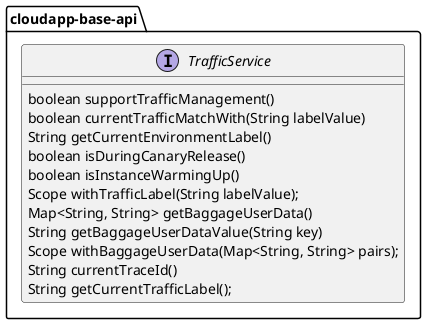

# 微服务治理设计与使用

# 设计说明

微服务设计主要参考[金丝雀发布应用](https://help.aliyun.com/zh/edas/user-guide/use-the-edas-console-to-implement-canary-releases-of-applications-in-kubernetes-clusters-2?spm=a2c4g.11186623.0.0.585065f0miJPfr)和[全链路泳道灰度发布应用](https://help.aliyun.com/zh/edas/user-guide/full-link-canary-grayscale-release-using-full-link-swimlanes-k8s?spm=a2c4g.11186623.0.0.77033e17LJObLs)，通过配置的灰度策略执行灰度发布过程。框架提供阿里版本实现，在实现中定义了微服务通用依赖组合：服务注册、服务发现、web 支持和 http 客户端，在使用时会自动引入上述依赖无需手动管理。


微服务治理抽象设计如下：



1.  定义流量治理服务接口 _**TrafficService**_ ，主要方法有：
    
    1.  _**supportTrafficManagement()**_ 检查是否支持流量治理，一般场景中流量治理能力需要服务框架结合 链路追踪（如：阿里巴巴 ARMS、Skywalking、OpenTelemetry等产品）进行支持；
        
    2.  _**currentTrafficMatchWith(String labelValue)**_ 检查当前请求是否带有流量标签，流量标签通常是一个字符串值，由上游应用程序根据流量规则（如：Http Header、Http Cookies、HTTP Parameters 等服务一定的规则）来进行设置；
        
    3.  _**getCurrentEnvironmentLabel()**_ 获取当前环境标签，环境标签是一个字符串，可以通过启动参数手动设置，也可以通过类似阿里巴巴 EDAS 应用平台等产品自动设置；
        
    4.  _**isDuringCanaryRelease()**_ 检查当前应用是否正在执行金丝雀发布；
        
    5.  _**isInstanceWarmingUp()**_ 检查当前应用在更新期间是否正在预热，EDAS产品请参考链接：[EDAS预热支持](https://help.aliyun.com/zh/edas/user-guide/warm-up)；
        
    6.   _**withTrafficLabel(String labelValue)**_ 构建 opentelemetry 范围对象以指定流量标签将被带到的位置；
        
    7.  _**getBaggageUserData()**_ 获取当前在链路传递中的用户请求数据，例如：eagleeye 请求上下文中的用户数据；
        
    8.  _**getBaggageUserDataValue(String key)**_ 获取当前在链路传递中用户某个请求数据，例如：eagleeye 请求上下文中的用户数据；
        
    9.  _**withBaggageUserData(Map<String, String> pairs)**_ 构建 opentelemetry 范围对象以指定用户数据将被带到的位置；
        
    10.  _**currentTraceId()**_ 获取当前traceid，例如：eagleeye请求上下文中的traceid；
        
    11.  _**getCurrentTrafficLabel()**_ 获取当前应用的已发布服务实例，例如：Spring Cloud 上下文中的服务实例。


# 使用说明

## 配置说明

微服务治理实现的配置如下：


1.  定义阿里云微服务治理实现的自动配置类 _**AliyunMicroServiceConfiguration**_ ，使用注解 _**@ConditionalOnProperty(name = "alicloud.deployment.mode", havingValue = "EDAS\_MANAGED")**_ ，应用配置如下：
    

|  **字段名**  |  **数据类型**  |  **默认值**  |  **备注**  |
| --- | --- | --- | --- |
|  alicloud.deployment.mode  |  String  |  EDAS\_MANAGED（固定值）  |  模式  |


## 场景一：给应用设置流量标识

### POM 配置

```xml
<dependencyManagement>
    <dependencies>
        <dependency>
            <groupId>${cloudapp.groupId}</groupId>
            <artifactId>cloudapp-framework-dependencies</artifactId>
            <version>${revision}</version>
            <type>pom</type>
            <scope>import</scope>
        </dependency>
    </dependencies>
</dependencyManagement>

<dependencies>
    <dependency>
        <groupId>${cloudapp.groupId}</groupId>
        <artifactId>spring-boot-starter-cloudapp</artifactId>
    </dependency>
    <dependency>
        <groupId>org.springframework.boot</groupId>
        <artifactId>spring-boot-starter-web</artifactId>
    </dependency>
    <dependency>
        <groupId>${cloudapp.groupId}.microservice</groupId>
        <artifactId>cloudapp-microservice-aliyun</artifactId>
    </dependency>
    <dependency>
        <groupId>com.alibaba.cloud</groupId>
        <artifactId>spring-cloud-starter-alibaba-nacos-discovery</artifactId>
        <version>${spring-cloud-alibaba.version}</version>
    </dependency>
</dependencies>


```

### 应用配置

```properties files
spring:
  application:
    name: cloudapp-microservice-aliyun-demo
  cloud:
    nacos:
      discovery:
        server-addr: localhost:8848

alicloud:
  deployment:
    mode: EDAS_MANAGED
    
server:
  port: 20001
```

### 使用验证

```java
@RestController
public class DemoController {

    private static final Logger logger = LoggerFactory.getLogger(DemoApplication.class);

    @Autowired
    TrafficService trafficService;

    @GetMapping("/{tag}")
    public String tag(HttpServletRequest request,
                      @PathVariable String tag) {
        if (tag == null || tag.isEmpty()) {
            return "";
        }
        logger.info("traffic label before inject: {}", trafficService.getCurrentTrafficLabel());
        try (Scope ignored = trafficService.withTrafficLabel(tag)){
            logger.info("traffic label after inject: {}", trafficService.getCurrentTrafficLabel());
        }
        return tag;
    }
}
```

