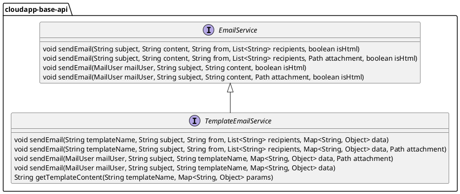

# 邮件设计与使用

# 设计说明

Framework 邮件部分基于 JavaMail 进行抽象设计，简化发送邮件方法，并提供通过模板（Freemarker、Thymeleaf）方式发送定制化邮件能力。


邮件抽象设计如下：



1.  定义邮件服务接口 _**EmailService**_ ，用于发送普通邮件，主要方法有：
    
    1.  _**sendEmail(String subject, String content, String from, List<String> recipients, boolean isHtml)**_ 发送邮件；
        
    2.  _**sendEmail(String subject, String content, String from, List<String> recipients, Path attachment, boolean isHtml)**_ 发送含附件的邮件；
        
    3.  _**sendEmail(MailUser mailUser, String subject, String content, boolean isHtml)**_ 发送邮件；
        
    4.  _**sendEmail(MailUser mailUser, String subject, String content, Path attachment, boolean isHtml)**_ 发送含附件的邮件；
        
2.  定义模板邮件服务接口 _**TemplateEmailService**_ ，用于发送定制邮件，主要方法有：
    
    1.  _**sendEmail(String templateName, String subject, String from, List<String> recipients, Map<String, Object> data)**_ 发送定制邮件；
        
    2.  _**sendEmail(String templateName, String subject, String from, List<String> recipients, Map<String, Object> data, Path attachment)**_ 发送含附件的定制邮件；
        
    3.  _**sendEmail(MailUser mailUser, String subject, String templateName, Map<String, Object> data)**_ 发送定制邮件；
        
    4.  _**sendEmail(MailUser mailUser, String subject, String templateName, Map<String, Object> data, Path attachment)**_ 发送含附件的定制邮件；
        
    5.  _**getTemplateContent(String templateName, Map<String, Object> params)**_ 获取定制邮件模板内容；
        

# 使用说明

## 配置说明

邮件实现的配置如下：

1.  定义邮件自动配置参数类 _**CloudAppMailProperties**_ ，使用注解 _**@ConfigurationProperties(prefix = "io.cloudapp.mail")**_ ，继承类 _**org.springframework.boot.autoconfigure.mail.MailProperties**_，_**MailProperties**_ 字段如下：
    

|  **字段名**  |  **数据类型**  |  **默认值**  |  **备注**  |
| --- | --- | --- | --- |
|  enabled  |  boolean  |  false  |  是否启用  |
|  host  |  String  |  \-  |  邮件服务器地址  |
|  port  |  Integer  |  \-  |  访问凭证，SK  |
|  username  |  String  |  \-  |  邮件服务器访问账号  |
|  password  |  String  |  \-  |  邮件服务器访问密码  |
|  protocol  |  String  |  smtp  |  邮件协议  |
|  defaultEncoding  |  String  |  \-  |  默认编码  |
|  properties  |  Map<String, String>  |  \-  |  自定义配置属性  |
|  jndiName  |  String  |  \-  |  邮件会话的 JNDI 名称，默认无需配置。  |

2.  定义邮件自动配置类 _**CloudAppMailAutoConfiguration**_ ，使用注解 _**@ConditionalOnProperty(prefix = "io.cloudapp.mail", name = "enabled", havingValue = "true", matchIfMissing = true)**_ ；
    


## 场景一：发送普通邮件

通过框架抽象接口方法发送邮件。

### POM 配置

引入邮件实现和 Starter 等依赖

```xml
……
<dependencyManagement>
    <dependencies>
        <dependency>
            <groupId>${groupId}</groupId>
            <artifactId>cloudapp-framework-dependencies</artifactId>
            <scope>import</scope>
            <type>pom</type>
            <version>${revision}</version>
        </dependency>
    </dependencies>
</dependencyManagement>

<dependencies>

    <dependency>
        <groupId>${groupId}</groupId>
        <artifactId>spring-boot-starter-cloudapp</artifactId>
    </dependency>

    <dependency>
        <groupId>${groupId}</groupId>
        <artifactId>cloudapp-spring-mail</artifactId>
    </dependency>

    <dependency>
        <groupId>org.springframework.boot</groupId>
        <artifactId>spring-boot-starter-web</artifactId>
    </dependency>

</dependencies>
……
```

### 应用配置

应用配置文件，在环境变量中配置邮件服务器地址 `${smtp_host}` 、 账号 `${username}` 、密码 `${password}` ，如下：

```yaml
server:
  port: 8080

spring:
  application:
    name: mail-demo

io:
  cloudapp:
    mail:
      enabled: true
      host: ${smtp_host}
      port: 465
      protocol: smtp
      username: ${username}
      password: ${password}
      properties:
        mail:
          smtp:
            auth: true
            socketFactory:
              class: javax.net.ssl.SSLSocketFactory
              fallback: false
            ssl:
              enable: true
              trust: ${smtp_host}
```

### 使用验证

通过邮件服务EmailService 调用发送邮件方法，指定发送人、接收人和邮件内容即可发送邮件，如下：

```java
@Service
public class MailDemoService {
    
    @Autowired
    private EmailService mailService;
    
    
    public void sendMail(String to, String subject, String content) {
        try {
            MailUser mailUser = new MailUser()
                    .setTo(to)
                    .setFrom(from);
            
            mailService.sendEmail(mailUser, subject, content, false);
            
        } catch (CloudAppException e) {
            logger.error("send mail fail:" + e.getMessage());
            throw new RuntimeException(e);
        }
    }
}
```

## 场景二：发送定制邮件

通过框架抽象接口方法发送freemarker模板定制邮件。

### POM 配置

引入邮件实现、freemarker 模板和 Starter 等依赖

```xml
<dependencyManagement>
    <dependencies>
        <dependency>
            <groupId>${groupId}</groupId>
            <artifactId>cloudapp-framework-dependencies</artifactId>
            <scope>import</scope>
            <type>pom</type>
            <version>${revision}</version>
        </dependency>
    </dependencies>
</dependencyManagement>

<dependencies>

    <dependency>
        <groupId>${groupId}</groupId>
        <artifactId>spring-boot-starter-cloudapp</artifactId>
    </dependency>

    <dependency>
        <groupId>${groupId}</groupId>
        <artifactId>cloudapp-spring-mail</artifactId>
    </dependency>

    <dependency>
        <groupId>org.springframework.boot</groupId>
        <artifactId>spring-boot-starter-web</artifactId>
    </dependency>

    <dependency>
        <groupId>org.freemarker</groupId>
        <artifactId>freemarker</artifactId>
    </dependency>

</dependencies>
```

### 应用配置

应用配置文件，在环境变量中配置邮件服务器地址 `${smtp_host}` 、账号 `${username}` 、密码 `${password}`，如下：

```yaml
server:
  port: 8080

spring:
  application:
    name: mail-demo

io:
  cloudapp:
    mail:
      enabled: true
      host: ${smtp_host}
      port: 465
      protocol: smtp
      username: ${username}
      password: ${password}
      properties:
        mail:
          smtp:
            auth: true
            socketFactory:
              class: javax.net.ssl.SSLSocketFactory
              fallback: false
            ssl:
              enable: true
              trust: ${smtp_host}
```

freemarker 模板示例如下：

```html
<!DOCTYPE html>
<html>
<head>
    <meta charset="utf-8">
    <title>Hello World!</title>
</head>
<body>
    <h1>This is a simple template display</h1>
    <h4>Hello ${name} </h4>
    <hr/>
    <h3><b>display info :</b></h3>
    <hr/>
    <#list showData?keys as key>
        <b>${key}:</b>${showData[key]!}<br/>
    </#list>
    <hr/>
</body>
</html>

```

### 使用验证

通过邮件服务TemplateEmailService 调用发送邮件方法，如下：

```java
@Service
public class MailDemoService {
    
    private static final String TEMPLATE_NAME = "test.ftl";
    
    @Autowired
    private TemplateEmailService templateEmailService;
    
    private JavaMailSender mailSender;
    
    public void sendMail(String to, String subject) {
        try {
            //template params
            Map<String, Object> params = new HashMap<>();
            params.put("name", to);
            params.put("showData", Collections.singletonMap("data", "test " +
                    "data"));
            
            templateEmailService.sendEmail(TEMPLATE_NAME, subject, from,
                                           Collections.singletonList(to), params
            );
        } catch (CloudAppException e) {
            logger.error("send mail fail:" + e.getMessage());
            throw new RuntimeException(e);
        }
    }
    
}
```